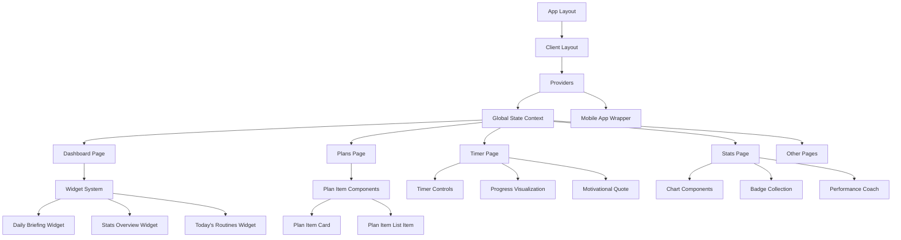
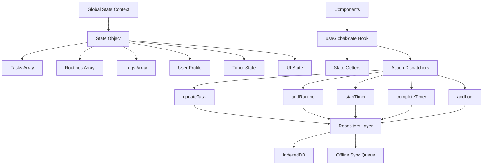
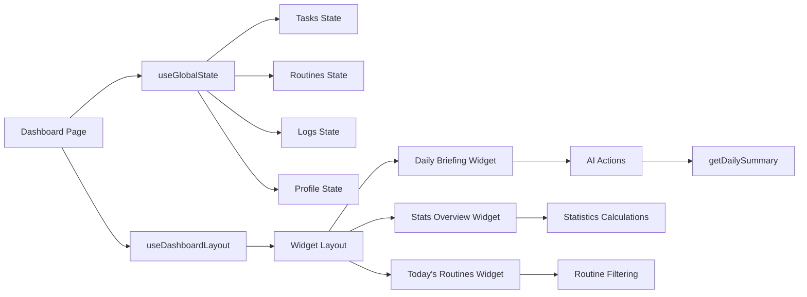
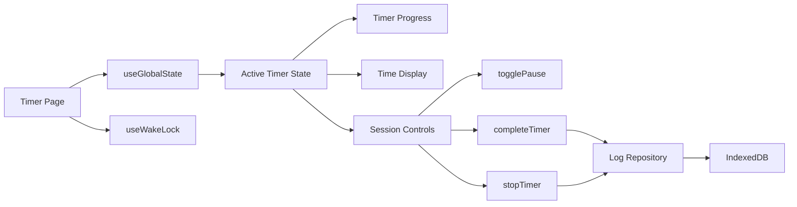
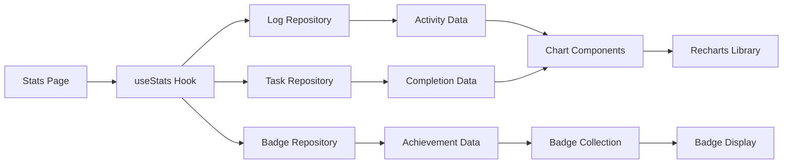

# Study Sentinel - Component & Data Flow Documentation

## 1. Component Architecture Overview

### 1.1 Component Hierarchy



### 1.2 Core Component Categories

#### Layout Components
- **RootLayout** (`layout.tsx`): Main application wrapper with metadata and font loading
- **ClientLayout** (`client-layout.tsx`): Client-side initialization, service worker registration, PWA setup
- **Providers**: Context providers for global state management
- **MobileAppWrapper**: Mobile-specific optimizations and native app features

#### Page Components
- **DashboardPage**: Customizable widget dashboard with drag-and-drop functionality
- **PlansPage**: Task and routine management with calendar integration
- **TimerPage**: Full-screen focus timer with progress tracking
- **StatsPage**: Analytics dashboard with comprehensive statistics
- **CalendarPage**: Schedule visualization and event management
- **ChatPage**: AI-powered coaching interface
- **ProfilePage**: User settings and profile management

#### Widget Components
- **DailyBriefingWidget**: AI-generated daily summary and motivation
- **StatsOverviewWidget**: Key performance metrics display
- **TodaysRoutinesWidget**: Today's scheduled routines
- **CompletedTodayWidget**: Completed tasks and routines for the day
- **ProductivityPieChart**: Visual breakdown of study categories
- **RealProductivityWidget**: Productivity trend analysis
- **ActiveProductivityWidget**: Active time tracking metrics

#### Feature Components
- **TimerControls**: Play, pause, complete, stop timer functionality
- **PlanItemCard**: Task/routine display in card format
- **PlanItemListItem**: Task/routine display in list format
- **AddItemDialog**: Modal for creating/editing tasks and routines
- **StopTimerDialog**: Confirmation dialog for stopping timer sessions
- **BadgeCollection**: Achievement system display
- **PerformanceCoach**: AI-powered performance insights

## 2. Data Flow Architecture

### 2.1 Global State Management



### 2.2 Data Persistence Layer

#### Repository Pattern Implementation

```typescript
// Base Repository for common CRUD operations
export class BaseRepository<T> {
  constructor(private table: Table<T, any>) {}
  
  async getAll(): Promise<T[]> {
    return await this.table.toArray();
  }
  
  async getById(id: any): Promise<T | undefined> {
    return await this.table.get(id);
  }
  
  async add(item: T): Promise<any> {
    // Offline-first: queue if offline
    if (!navigator.onLine) {
      await this.queueOperation('add', item);
    }
    return await this.table.add(item);
  }
}

// Specific repositories extend base functionality
export class TaskRepository extends BaseRepository<StudyTask> {
  async getTasksByDate(date: Date): Promise<StudyTask[]> {
    return await this.table
      .where('dueDate')
      .equals(format(date, 'yyyy-MM-dd'))
      .toArray();
  }
  
  async getOverdueTasks(): Promise<StudyTask[]> {
    const today = format(new Date(), 'yyyy-MM-dd');
    return await this.table
      .where('dueDate')
      .below(today)
      .and(task => task.status !== 'completed')
      .toArray();
  }
}
```

### 2.3 Component Data Connections

#### Dashboard Page Data Flow



#### Timer Page Data Flow



#### Stats Page Data Flow



## 3. Custom Hooks Architecture

### 3.1 Core Hooks

#### useGlobalState Hook
```typescript
export const useGlobalState = () => {
  const context = useContext(GlobalStateContext);
  if (!context) {
    throw new Error('useGlobalState must be used within GlobalStateProvider');
  }
  
  return {
    state: context.state,
    // Task operations
    addTask: context.addTask,
    updateTask: context.updateTask,
    deleteTask: context.deleteTask,
    // Routine operations
    addRoutine: context.addRoutine,
    updateRoutine: context.updateRoutine,
    deleteRoutine: context.deleteRoutine,
    // Timer operations
    startTimer: context.startTimer,
    togglePause: context.togglePause,
    completeTimer: context.completeTimer,
    stopTimer: context.stopTimer,
    // Log operations
    addLog: context.addLog,
    updateLog: context.updateLog,
    removeLog: context.removeLog,
  };
};
```

#### useStats Hook
```typescript
export const useStats = ({ timeRange, selectedDate }) => {
  const [stats, setStats] = useState(null);
  const { state } = useGlobalState();
  
  useEffect(() => {
    const calculateStats = async () => {
      const logs = await logRepository.getLogsByDateRange(startDate, endDate);
      const tasks = await taskRepository.getCompletedTasks(startDate, endDate);
      
      const timeRangeStats = calculateTimeRangeStats(logs);
      const badgeStats = calculateBadgeProgress(logs, tasks);
      const chartData = prepareChartData(logs, timeRange);
      
      setStats({
        timeRangeStats,
        badgeStats,
        chartData,
        // ... other calculated stats
      });
    };
    
    calculateStats();
  }, [timeRange, selectedDate, state.logs]);
  
  return stats;
};
```

#### usePlanData Hook
```typescript
export const usePlanData = (selectedDate: Date) => {
  const [planData, setPlanData] = useState({
    upcomingItems: [],
    overdueTasks: [],
    completedForDay: [],
    isLoaded: false
  });
  
  const { state } = useGlobalState();
  
  useEffect(() => {
    const loadPlanData = async () => {
      const dateStr = format(selectedDate, 'yyyy-MM-dd');
      
      // Get tasks for selected date
      const dayTasks = state.tasks.filter(task => 
        task.dueDate === dateStr && task.status !== 'completed'
      );
      
      // Get routines for selected date
      const dayRoutines = state.routines.filter(routine => 
        routine.isActive && routine.daysOfWeek.includes(selectedDate.getDay())
      );
      
      // Get overdue tasks
      const overdue = state.tasks.filter(task => 
        task.dueDate < dateStr && task.status !== 'completed'
      );
      
      // Get completed items for the day
      const completed = state.logs.filter(log => 
        format(parseISO(log.timestamp), 'yyyy-MM-dd') === dateStr &&
        !log.isUndone
      );
      
      setPlanData({
        upcomingItems: [...dayTasks.map(t => ({ type: 'task', data: t })), 
                      ...dayRoutines.map(r => ({ type: 'routine', data: r }))],
        overdueTasks: overdue,
        completedForDay: completed,
        isLoaded: true
      });
    };
    
    loadPlanData();
  }, [selectedDate, state.tasks, state.routines, state.logs]);
  
  return planData;
};
```

## 4. Offline-First Architecture

### 4.1 Service Worker Implementation

```javascript
// Service Worker with Workbox
importScripts('https://storage.googleapis.com/workbox-cdn/releases/6.2.0/workbox-sw.js');

// Cache strategies
workbox.routing.registerRoute(
  ({ request }) => request.destination === 'document',
  new workbox.strategies.CacheFirst()
);

workbox.routing.registerRoute(
  ({ request }) => request.destination === 'script' || request.destination === 'style',
  new workbox.strategies.StaleWhileRevalidate()
);

// API caching for offline functionality
workbox.routing.registerRoute(
  ({ url }) => url.pathname.startsWith('/api/'),
  new workbox.strategies.StaleWhileRevalidate({
    cacheName: 'api-cache',
  })
);
```

### 4.2 Sync Engine

```typescript
export class SyncEngine {
  private syncInterval: NodeJS.Timeout | null = null;
  
  start() {
    // Sync every 5 minutes when online
    this.syncInterval = setInterval(() => {
      if (navigator.onLine) {
        this.syncOutbox();
      }
    }, 5 * 60 * 1000);
    
    // Sync immediately when coming online
    window.addEventListener('online', () => {
      this.syncOutbox();
    });
  }
  
  async syncOutbox() {
    const pendingOperations = await db.outbox.toArray();
    
    for (const operation of pendingOperations) {
      try {
        await this.executeOperation(operation);
        await db.outbox.delete(operation.id!);
      } catch (error) {
        console.error('Sync failed for operation:', operation, error);
        // Implement exponential backoff retry logic
      }
    }
  }
  
  private async executeOperation(operation: any) {
    // Simulate API calls - in real implementation, call actual backend
    switch (operation.operation) {
      case 'add':
        console.log('Syncing add operation:', operation.data);
        break;
      case 'update':
        console.log('Syncing update operation:', operation.data);
        break;
      case 'delete':
        console.log('Syncing delete operation:', operation.data);
        break;
    }
  }
}
```

## 5. AI Integration Architecture

### 5.1 AI Flow Structure

```typescript
// Daily Summary Flow
export const generateDailySummary = ai.defineFlow(
  {
    name: 'generateDailySummary',
    inputSchema: DailySummaryInputSchema,
    outputSchema: DailySummaryOutputSchema,
  },
  async (input) => {
    const { profile, tasks, routines, logs } = input;
    
    const prompt = `
      As an expert life coach, provide a daily summary for:
      - User: ${profile.name}
      - Dream: ${profile.dream}
      - Completed Tasks: ${tasks.length}
      - Activity Logs: ${logs.length}
      
      Provide evaluation and motivation in structured format.
    `;
    
    const result = await generateWithFallback({ prompt });
    
    // Parse structured response
    const evaluationMatch = result.text.match(/EVALUATION:([\s\S]*?)(?=MOTIVATION:|$)/);
    const motivationMatch = result.text.match(/MOTIVATION:([\s\S]*/)/);
    
    return {
      evaluation: evaluationMatch ? evaluationMatch[1].trim() : 'Keep up the great work!',
      motivationalParagraph: motivationMatch ? motivationMatch[1].trim() : 'Stay focused on your goals!'
    };
  }
);
```

### 5.2 Chat Integration

```typescript
// Positive Psychology Chat Flow
export const generateChatbotResponse = ai.defineFlow(
  {
    name: 'generateChatbotResponse',
    inputSchema: PositivePsychologistInputSchema,
    outputSchema: PositivePsychologistOutputSchema,
  },
  async (input) => {
    const { chatHistory, profile, dailySummary, upcomingTasks, weeklyStats } = input;
    
    const systemPrompt = `
      You are a positive psychology coach. Be warm, empathetic, and encouraging.
      
      User Context:
      - Name: ${profile?.name}
      - Dream: ${profile?.dream}
      - Today's evaluation: ${dailySummary?.evaluation}
      - Upcoming tasks: ${upcomingTasks?.map(t => t.title).join(', ')}
      - Weekly study hours: ${weeklyStats?.totalHours}
    `;
    
    const response = await ai.generate({
      system: systemPrompt,
      messages: chatHistory.map(msg => ({
        role: msg.role,
        content: [{ text: msg.content }]
      }))
    });
    
    return { response: response.text };
  }
);
```

## 6. Performance Optimizations

### 6.1 Code Splitting and Lazy Loading

```typescript
// Lazy load heavy components
const StudyActivityChart = React.lazy(
  () => import('@/components/stats/weekly-chart')
);

const AddItemDialog = dynamic(
  () => import('@/components/tasks/add-task-dialog').then((m) => m.AddItemDialog),
  { ssr: false }
);
```

### 6.2 Memory Management

```typescript
// Wake lock for timer sessions
export const useWakeLock = () => {
  const [wakeLock, setWakeLock] = useState<WakeLockSentinel | null>(null);
  
  const requestWakeLock = async () => {
    try {
      const lock = await navigator.wakeLock.request('screen');
      setWakeLock(lock);
    } catch (err) {
      console.error('Wake lock failed:', err);
    }
  };
  
  const releaseWakeLock = async () => {
    if (wakeLock) {
      await wakeLock.release();
      setWakeLock(null);
    }
  };
  
  useEffect(() => {
    return () => {
      releaseWakeLock();
    };
  }, []);
  
  return { requestWakeLock, releaseWakeLock };
};
```

### 6.3 Data Optimization

```typescript
// Memoized calculations for expensive operations
const useStatsCalculations = (logs: LogEvent[], timeRange: string) => {
  return useMemo(() => {
    const filteredLogs = filterLogsByTimeRange(logs, timeRange);
    const totalDuration = calculateTotalDuration(filteredLogs);
    const categoryBreakdown = calculateCategoryBreakdown(filteredLogs);
    const productivityScore = calculateProductivityScore(filteredLogs);
    
    return {
      totalDuration,
      categoryBreakdown,
      productivityScore,
      chartData: prepareChartData(filteredLogs)
    };
  }, [logs, timeRange]);
};
```