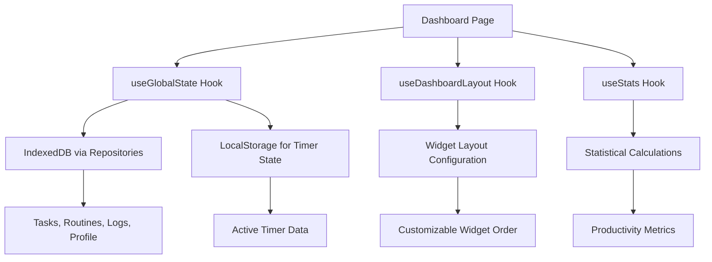
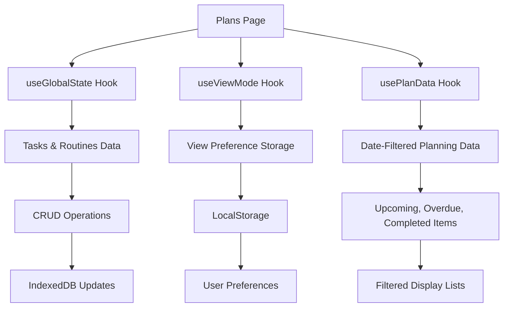
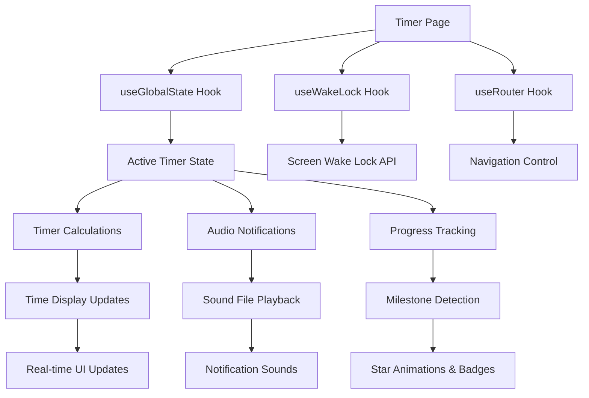
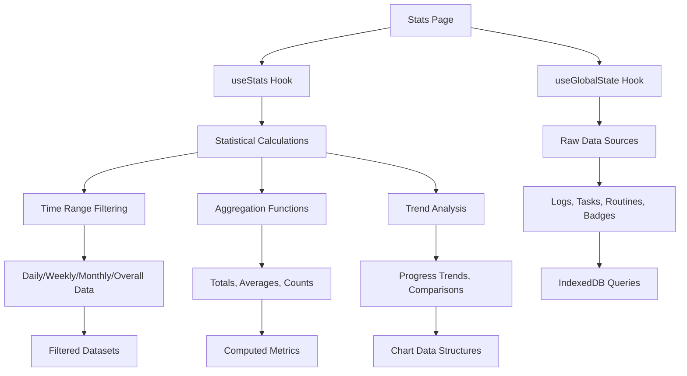
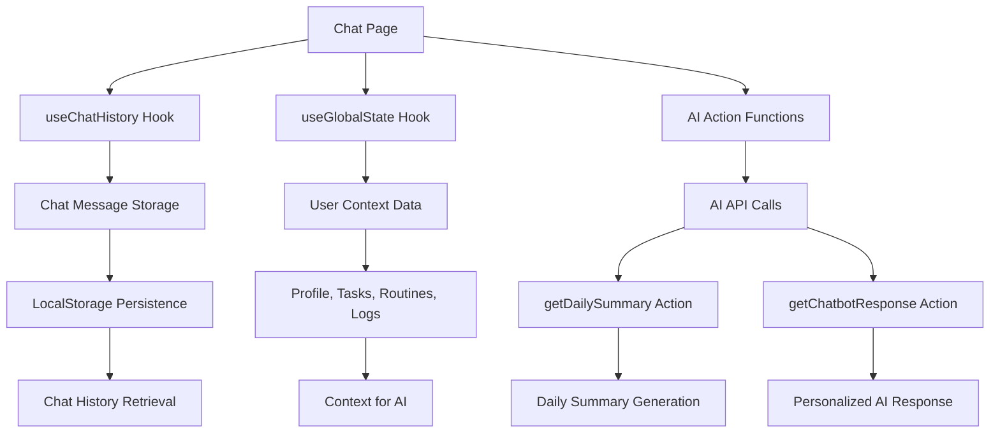
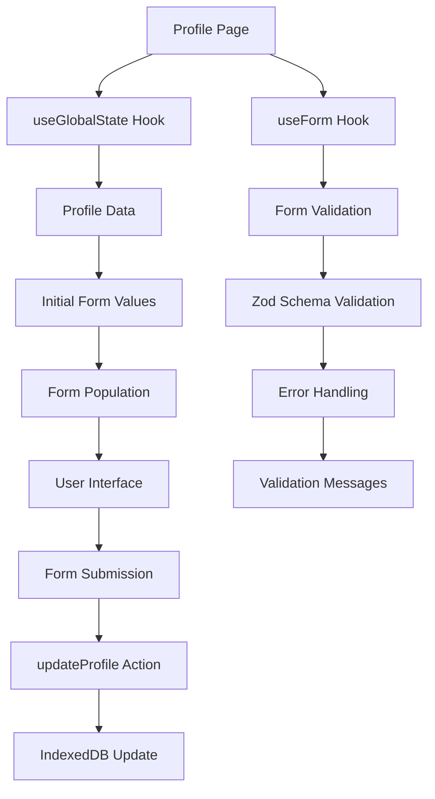
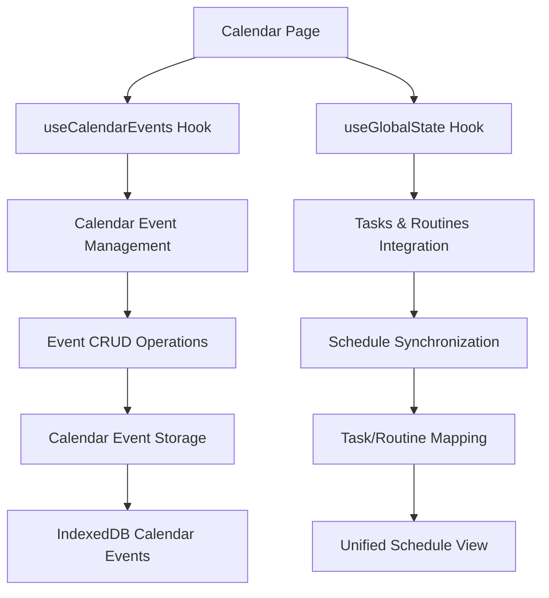
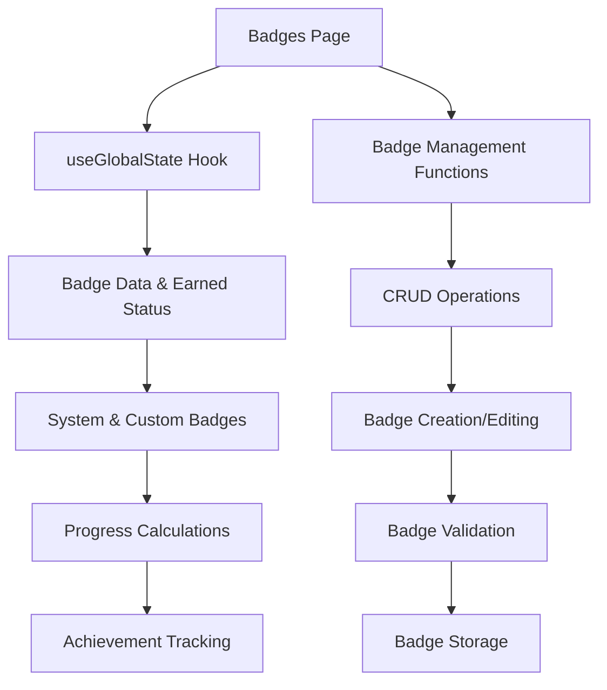

# Study Sentinel - Page Components & Data Flow Documentation

## Table of Contents
1. [Dashboard Page](#dashboard-page)
2. [Plans Page](#plans-page)
3. [Timer Page](#timer-page)
4. [Stats Page](#stats-page)
5. [Chat Page](#chat-page)
6. [Profile Page](#profile-page)
7. [Calendar Page](#calendar-page)
8. [Badges Page](#badges-page)
9. [Archive Page](#archive-page)
10. [Logs Page](#logs-page)
11. [Settings Page](#settings-page)
12. [Briefing Page](#briefing-page)
13. [Timetable Page](#timetable-page)
14. [Let's Start Page](#lets-start-page)

---

## Dashboard Page
**File:** `src/app/page.tsx`

### Components Used
- **DailyBriefingWidget** - Displays daily summary and motivational messages
- **StatsOverviewWidget** - Shows key statistics and today's badges
- **DailyActiveProductivityWidget** - Real-time productivity metrics
- **UnlockedBadgesWidget** - Recently earned badges display
- **CompletedTodayWidget** - Today's completed activities with undo functionality
- **TodaysRoutinesWidget** - Current day's routine schedule
- **TodaysPlanWidget** - Upcoming tasks and plans
- **AchievementCountdownWidget** - Progress toward goals
- **AddItemDialog** - Quick task/routine creation
- **CustomizeDialog** - Dashboard layout customization
- **SortableWidget** - Drag-and-drop widget reordering

### Data Flow


### Database Interactions
- **Read Operations:**
  - `taskRepository.getAll()` - Fetch all tasks
  - `routineRepository.getAll()` - Fetch all routines
  - `logRepository.getLogsByDate()` - Get today's and previous day's logs
  - `badgeRepository.getAll()` - Load available badges
  - `profileRepository.getById()` - User profile data

- **Write Operations:**
  - `updateTask()` - Mark tasks complete/incomplete
  - `addLog()` - Record activity completions
  - `removeLog()` - Hard delete activity records
  - `updateLog()` - Soft undo completions

### State Management
- **Global State:** Tasks, routines, logs, profile, badges, timer state
- **Local State:** Widget customization dialog, layout preferences
- **Persistent Storage:** Widget layout in localStorage, timer state preservation

---

## Plans Page
**File:** `src/app/plans/page.tsx`

### Components Used
- **ViewModeToggle** - Switch between card and list views
- **PlanItemCard** - Card view for tasks and routines
- **PlanListItem** - Compact list view for items
- **CompletedTodayWidget** - Shows completed activities for selected date
- **AddItemDialog** - Create new tasks and routines
- **Calendar** - Date picker for navigation
- **Accordion** - Collapsible overdue tasks section

### Data Flow


### Database Interactions
- **Read Operations:**
  - `taskRepository.getAll()` - All tasks for filtering
  - `routineRepository.getAll()` - All routines for scheduling
  - `logRepository.getLogsByDate()` - Completed items for specific date

- **Write Operations:**
  - `addTask()` - Create new tasks
  - `updateTask()` - Modify task properties, status changes
  - `addRoutine()` - Create new routines
  - `updateRoutine()` - Modify routine properties
  - `deleteRoutine()` - Remove routines
  - `pushTaskToNextDay()` - Reschedule tasks
  - `addLog()` - Record manual completions

### State Management
- **Global State:** All tasks, routines, and logs
- **Local State:** Selected date, editing dialogs, view mode
- **Computed State:** Filtered upcoming/overdue items based on selected date

---

## Timer Page
**File:** `src/app/timer/page.tsx`

### Components Used
- **Hourglass** - Animated progress visualization with sand effect
- **TimerControls** - Play/pause, complete, stop buttons
- **StopTimerDialog** - Confirmation dialog for stopping timer
- **MotivationalQuote** - Inspirational messages during study
- **AnimatePresence** - Star animation for milestones

### Data Flow


### Database Interactions
- **Read Operations:**
  - Active timer state from localStorage
  - Sound settings from global state
  - Current task/routine details

- **Write Operations:**
  - `completeTimer()` - Record successful completion
  - `stopTimer()` - Record early termination with reason
  - `addLog()` - Create completion/stop log entries
  - Timer state persistence to localStorage

### State Management
- **Global State:** Active timer item, pause state, time display, progress
- **Local State:** Stop dialog visibility
- **Persistent State:** Timer state in localStorage for recovery after page refresh
- **Real-time Updates:** 1-second interval updates for time display and progress

---

## Stats Page
**File:** `src/app/stats/page.tsx`

### Components Used
- **Tabs** - Time range selection (Daily, Weekly, Monthly, Overall)
- **StatCardGrid** - Key metrics overview cards
- **BadgeCollection** - Earned badges display with categories
- **ProductivityPieChart** - Focus vs break time visualization
- **StatComparison** - Day-over-day comparisons
- **PerformanceCoach** - AI-powered insights and recommendations
- **DailyActivityCard** - Timeline view of study sessions
- **StudyActivityChart** - Weekly/monthly trend charts
- **PeakProductivityCard** - Optimal study time analysis
- **RoutineStatsList** - Routine performance metrics
- **RealProductivityWidget** - Actual productive time tracking
- **ActiveProductivityWidget** - Total active time tracking

### Data Flow


### Database Interactions
- **Read Operations:**
  - `logRepository.getAll()` - All historical logs for analysis
  - `taskRepository.getAll()` - Task completion data
  - `routineRepository.getAll()` - Routine performance data
  - `badgeRepository.getAll()` - Badge earning history

- **Write Operations:** None (read-only analytics page)

### State Management
- **Global State:** All historical data for calculations
- **Local State:** Selected time range, selected date for daily view
- **Computed State:** Extensive statistical calculations including:
  - Total study time, session counts, streak calculations
  - Productivity ratios, peak performance times
  - Badge earning rates, routine completion percentages
  - Trend analysis and comparative metrics

---

## Chat Page
**File:** `src/app/chat/page.tsx`

### Components Used
- **MessageBubble** - Individual chat message display with role-based styling
- **ReactMarkdown** - Render AI responses with markdown formatting
- **Textarea** - Message input with keyboard shortcuts
- **Button** - Send message and clear chat actions
- **Skeleton** - Loading states for messages

### Data Flow


### Database Interactions
- **Read Operations:**
  - `profileRepository.getById()` - User profile for AI context
  - `taskRepository.getAll()` - Current tasks for AI awareness
  - `routineRepository.getAll()` - Routines for AI context
  - `logRepository.getLogsByDate()` - Recent activity for AI context
  - Chat history from localStorage

- **Write Operations:**
  - Chat messages to localStorage
  - Clear chat history from localStorage

### State Management
- **Global State:** User profile, tasks, routines, logs for AI context
- **Local State:** Current message input, sending state
- **Persistent State:** Chat history in localStorage
- **AI Integration:** Real-time context gathering and response generation

---

## Profile Page
**File:** `src/app/profile/page.tsx`

### Components Used
- **Card** - Sectioned form layout
- **Input** - Text, email, number, date, time inputs
- **Textarea** - Multi-line text fields
- **Switch** - Boolean preference toggles
- **Select** - Dropdown selections
- **Label** - Form field labels
- **Button** - Form submission
- **Skeleton** - Loading state display

### Data Flow


### Database Interactions
- **Read Operations:**
  - `profileRepository.getById()` - Load current profile data

- **Write Operations:**
  - `updateProfile()` - Save profile changes to IndexedDB
  - Sound settings updates to localStorage

### State Management
- **Global State:** User profile data, sound settings
- **Local State:** Form state, validation errors, dirty state tracking
- **Form Management:** React Hook Form with Zod validation
- **Persistence:** Immediate save to IndexedDB on form submission

---

## Calendar Page
**File:** `src/app/calendar/page.tsx`

### Components Used
- **CalendarView** - Main calendar grid display
- **DayView** - Detailed single day view
- **WeekView** - Weekly schedule overview
- **EventDialog** - Create/edit calendar events
- **EventForm** - Event creation form
- **EventItem** - Individual event display
- **TodoList** - Daily task integration

### Data Flow


### Database Interactions
- **Read Operations:**
  - Calendar events from IndexedDB
  - Tasks and routines for schedule integration
  - User preferences for calendar display

- **Write Operations:**
  - Create, update, delete calendar events
  - Mark events as completed
  - Sync with task/routine completions

### State Management
- **Global State:** Tasks, routines for schedule integration
- **Local State:** Selected date, view mode, event dialogs
- **Calendar State:** Event management, date navigation

---

## Badges Page
**File:** `src/app/badges/page.tsx`

### Components Used
- **BadgeCard** - Individual badge display with progress
- **BadgeDialog** - Create/edit custom badges
- **IconPicker** - Badge icon selection
- **DurationInput** - Time-based badge conditions
- **BadgeListItem** - Compact badge list view

### Data Flow


### Database Interactions
- **Read Operations:**
  - `badgeRepository.getAll()` - All available badges
  - Earned badges from localStorage
  - User logs for progress calculation

- **Write Operations:**
  - `addBadge()` - Create custom badges
  - `updateBadge()` - Modify badge properties
  - `deleteBadge()` - Remove custom badges
  - Update earned badges in localStorage

### State Management
- **Global State:** All badges, earned status, user progress
- **Local State:** Badge creation/editing dialogs
- **Progress Tracking:** Real-time badge progress calculations

---

## Archive Page
**File:** `src/app/archive/page.tsx`

### Components Used
- **TaskCard** - Archived task display
- **EmptyState** - No archived items message
- **Button** - Unarchive actions

### Database Interactions
- **Read Operations:**
  - Filtered tasks with `status: 'archived'`

- **Write Operations:**
  - `unarchiveTask()` - Restore tasks to active status

---

## Logs Page
**File:** `src/app/logs/page.tsx`

### Components Used
- **LogEntry** - Individual log item display
- **DateFilter** - Log date range selection
- **ExportButton** - Data export functionality

### Database Interactions
- **Read Operations:**
  - `logRepository.getAll()` - All historical logs
  - Date-filtered log queries

- **Write Operations:** None (read-only log viewing)

---

## Settings Page
**File:** `src/app/settings/page.tsx`

### Components Used
- **SettingsCard** - Grouped settings sections
- **Switch** - Boolean setting toggles
- **Select** - Option selections
- **Slider** - Numeric value settings

### Database Interactions
- **Read Operations:**
  - User preferences from localStorage
  - Profile settings from IndexedDB

- **Write Operations:**
  - Update user preferences
  - Modify notification settings
  - Save theme preferences

---

## Briefing Page
**File:** `src/app/briefing/page.tsx`

### Components Used
- **DailyBriefing** - AI-generated daily summary
- **MotivationalMessage** - Personalized encouragement
- **ProgressOverview** - Quick stats display

### Database Interactions
- **Read Operations:**
  - Previous day's logs for AI context
  - User profile for personalization
  - Current tasks and routines

---

## Timetable Page
**File:** `src/app/timetable/page.tsx`

### Components Used
- **RoutineListItem** - Weekly routine schedule display
- **AddRoutineDialog** - Create new routines
- **TimeSlot** - Individual time block display

### Database Interactions
- **Read Operations:**
  - `routineRepository.getAll()` - All routines for schedule

- **Write Operations:**
  - `addRoutine()` - Create new routines
  - `updateRoutine()` - Modify routine schedules

---

## Let's Start Page
**File:** `src/app/lets-start/page.tsx`

### Components Used
- **WelcomeMessage** - Onboarding introduction
- **QuickSetup** - Initial configuration
- **GetStartedButton** - Navigation to main app

### Database Interactions
- **Write Operations:**
  - Initial profile setup
  - Default preferences configuration
  - Sample data creation

---

## Common Data Flow Patterns

### Global State Management
All pages utilize the `useGlobalState` hook which provides:
- Centralized state management via React Context
- IndexedDB integration through repository pattern
- Real-time updates across components
- Offline-first data persistence

### Repository Pattern
Database interactions follow a consistent repository pattern:
```typescript
interface IRepository<T> {
  getAll(): Promise<T[]>;
  getById(id: string): Promise<T | null>;
  add(item: T): Promise<string>;
  update(id: string, item: Partial<T>): Promise<number>;
  delete(id: string): Promise<void>;
}
```

### Offline Support
- All data operations queue to `outbox` table when offline
- Sync engine processes queued operations when online
- Service worker caches pages and API responses
- LocalStorage used for critical state preservation

### Performance Optimizations
- Lazy loading of heavy components
- Memoized calculations in hooks
- Efficient re-rendering with React.memo
- IndexedDB indexing for fast queries
- Virtual scrolling for large lists