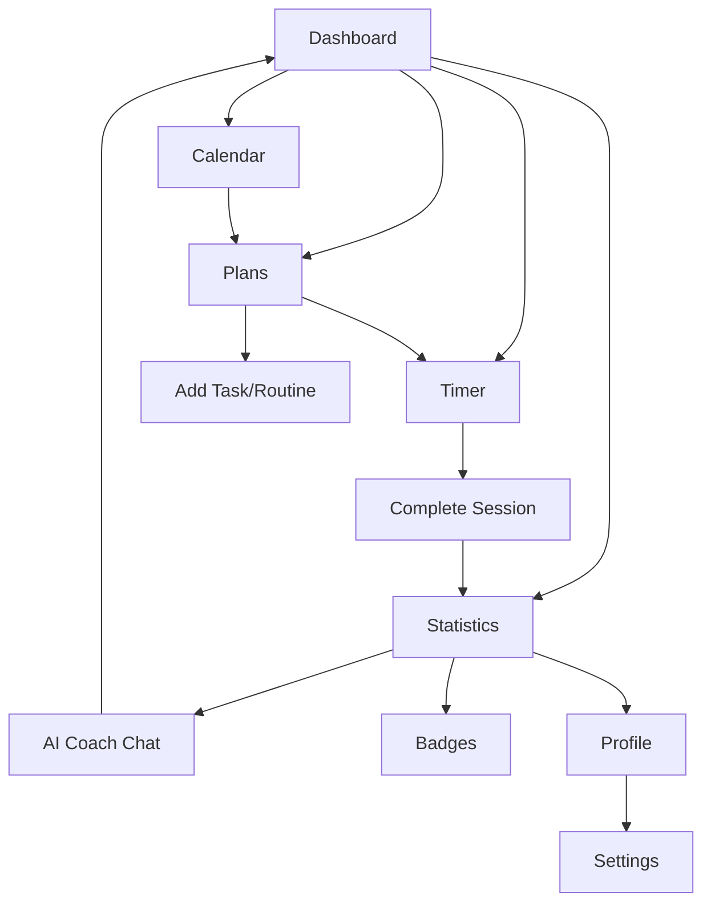

# Study Sentinel - Product Requirements Document

## 1. Product Overview

Study Sentinel is a comprehensive study management and productivity tracking application designed to help students and professionals organize their learning activities, track progress, and maintain motivation through gamification and AI-powered insights.

The application solves the problem of scattered study planning, lack of progress visibility, and motivation decline by providing an integrated platform that combines task management, time tracking, statistics analysis, and personalized coaching. It targets students, professionals, and lifelong learners who want to optimize their study habits and achieve their educational goals.

The product aims to become the go-to solution for study productivity, offering both offline-first functionality and AI-powered personalized guidance to maximize learning effectiveness.

## 2. Core Features

### 2.1 User Roles

The application operates with a single user model focused on individual productivity:

| Role | Registration Method | Core Permissions |
|------|---------------------|------------------|
| User | Local profile creation | Full access to all features including task management, statistics, AI coaching, and data export |

### 2.2 Feature Module

Our Study Sentinel application consists of the following main pages:

1. **Dashboard**: Customizable widget-based overview, daily briefing, statistics summary, today's routines
2. **Plans**: Task and routine management, calendar view, completion tracking, overdue items
3. **Timer**: Full-screen focus timer, motivational quotes, progress visualization, session controls
4. **Statistics**: Comprehensive analytics, productivity charts, badge system, performance insights
5. **Calendar**: Schedule visualization, event management, routine planning
6. **Chat**: AI-powered positive psychology coach, personalized motivation, progress discussion
7. **Profile**: User settings, goals management, preferences, data export
8. **Settings**: Application configuration, sound settings, theme preferences, data management
9. **Badges**: Achievement system, progress milestones, gamification elements
10. **Archive**: Historical data, completed items, past statistics
11. **Logs**: Activity history, session records, detailed tracking
12. **Timetable**: Schedule planning, routine organization, time blocking

### 2.3 Page Details

| Page Name | Module Name | Feature description |
|-----------|-------------|---------------------|
| Dashboard | Widget System | Drag-and-drop customizable widgets including daily briefing, stats overview, today's routines, and productivity metrics |
| Dashboard | Daily Briefing | AI-generated daily summary with yesterday's evaluation and today's motivation based on user activity |
| Dashboard | Quick Actions | Fast access to start timer, add tasks, view stats, and navigate to key features |
| Plans | Task Management | Create, edit, delete, and organize study tasks with due dates, priorities, and categories |
| Plans | Routine Management | Set up recurring study routines with flexible scheduling and completion tracking |
| Plans | Calendar Integration | Date-based view of tasks and routines with navigation and filtering capabilities |
| Plans | Overdue Tracking | Automatic identification and management of overdue tasks with push-to-next-day functionality |
| Timer | Focus Timer | Full-screen Pomodoro-style timer with customizable durations and break intervals |
| Timer | Progress Visualization | Animated hourglass showing session progress with sand animation effects |
| Timer | Session Controls | Play, pause, complete, and stop controls with confirmation dialogs |
| Timer | Motivational Support | Dynamic motivational quotes and star-based achievement system during sessions |
| Statistics | Analytics Dashboard | Comprehensive charts showing daily, weekly, monthly, and overall productivity metrics |
| Statistics | Badge System | Achievement tracking with categorized badges for various milestones and accomplishments |
| Statistics | Performance Insights | AI-powered analysis of study patterns, peak productivity times, and improvement suggestions |
| Statistics | Comparison Tools | Day-to-day, week-to-week performance comparisons with trend analysis |
| Calendar | Schedule View | Monthly, weekly, and daily calendar views with task and routine visualization |
| Calendar | Event Management | Create, edit, and manage calendar events with integration to tasks and routines |
| Chat | AI Coach | Positive psychology-based chatbot providing personalized motivation and study guidance |
| Chat | Context Awareness | AI responses based on user profile, recent activity, and performance data |
| Profile | User Settings | Personal information, study goals, dream tracking, and preference management |
| Profile | Data Management | Export functionality, data backup, and account settings |
| Settings | Application Config | Theme selection, sound settings, notification preferences, and display options |
| Settings | Timer Settings | Customizable timer durations, break intervals, and session preferences |
| Badges | Achievement Display | Visual badge collection with progress tracking and unlock conditions |
| Badges | Gamification | Point system, streak tracking, and milestone celebrations |
| Archive | Historical Data | Access to completed tasks, past sessions, and archived information |
| Logs | Activity Tracking | Detailed session logs, completion records, and activity history |
| Timetable | Schedule Planning | Weekly timetable view with time blocking and routine scheduling |

## 3. Core Process

### Main User Flow

The primary user journey follows this pattern:

1. **Setup**: User creates profile with name and study goals/dreams
2. **Planning**: User adds tasks and routines for upcoming study sessions
3. **Execution**: User starts timer sessions, tracks progress, and completes activities
4. **Review**: User views statistics, receives AI feedback, and adjusts plans
5. **Motivation**: User interacts with AI coach, earns badges, and maintains streaks

### Daily Workflow

1. User opens dashboard to see daily briefing and today's planned activities
2. User reviews overdue items and adjusts schedule as needed
3. User starts timer sessions for focused study periods
4. User marks tasks and routines as complete throughout the day
5. User reviews daily statistics and receives motivational feedback
6. User plans next day's activities and sets up routines

## 4. User Interface Design

### 4.1 Design Style

- **Primary Colors**: Blue-based theme with customizable dark/light modes
- **Secondary Colors**: Yellow for achievements, green for completion, red for alerts
- **Button Style**: Rounded corners with subtle shadows, consistent sizing across components
- **Font**: System fonts with clear hierarchy - headings, body text, and monospace for timers
- **Layout Style**: Card-based design with clean spacing, responsive grid layouts, and mobile-first approach
- **Icons**: Lucide React icons for consistency, with custom animations for achievements
- **Animations**: Smooth transitions, progress animations, and celebration effects for gamification

### 4.2 Page Design Overview

| Page Name | Module Name | UI Elements |
|-----------|-------------|-------------|
| Dashboard | Widget Grid | Drag-and-drop cards with rounded corners, subtle shadows, responsive grid layout |
| Dashboard | Daily Briefing | Highlighted card with sparkle icon, gradient background, italic text for AI content |
| Plans | Task Cards | Clean white cards with priority indicators, due date badges, and action buttons |
| Plans | Calendar Picker | Popover calendar with navigation controls, today highlighting, and date selection |
| Timer | Full Screen | Minimalist design with large monospace timer display, animated hourglass background |
| Timer | Controls | Large rounded buttons with icons, clear visual hierarchy, mobile-optimized spacing |
| Statistics | Charts | Interactive charts with hover effects, color-coded categories, responsive design |
| Statistics | Badge Grid | Visual badge collection with unlock animations, progress indicators, and categories |
| Chat | Message Interface | Chat bubbles with distinct styling for user/AI, markdown support, typing indicators |
| Profile | Form Layout | Clean form design with grouped sections, validation feedback, and save confirmations |

### 4.3 Responsiveness

The application is mobile-first with adaptive design:
- **Mobile**: Optimized touch interactions, full-screen timer, stacked layouts
- **Tablet**: Grid layouts with larger touch targets, side-by-side content
- **Desktop**: Multi-column layouts, hover effects, keyboard shortcuts
- **PWA Features**: Offline functionality, installable app, native-like experience