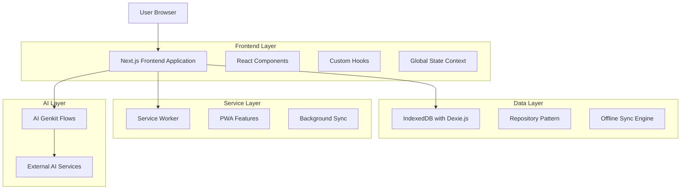
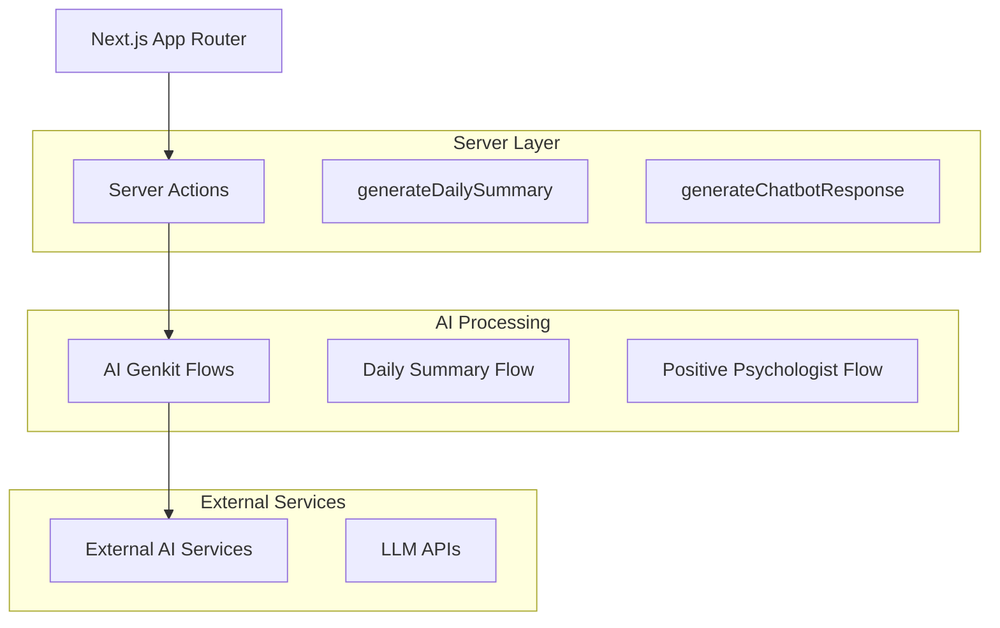
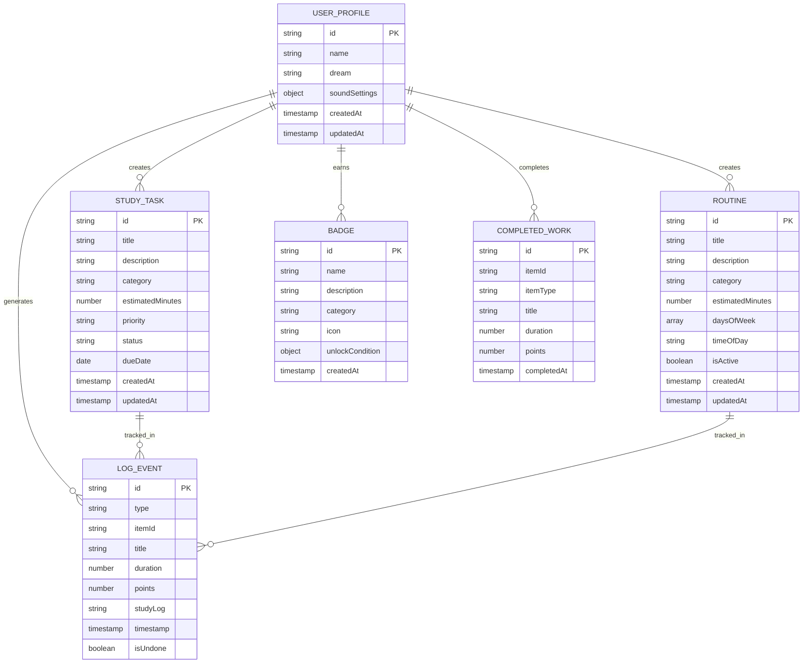

# Study Sentinel - Technical Architecture Document

## 1. Architecture Design



## 2. Technology Description

- **Frontend**: Next.js@15.3.3 + React@18 + TypeScript + Tailwind CSS@3 + shadcn/ui components
- **State Management**: React Context API with custom hooks
- **Database**: IndexedDB with Dexie.js for offline-first data persistence
- **PWA**: Service Worker with Workbox for caching and offline functionality
- **AI Integration**: Google Genkit for AI flows and LLM integration
- **UI Components**: Radix UI primitives with custom styling
- **Charts**: Recharts for data visualization
- **Animations**: Framer Motion for smooth transitions and effects
- **Date Handling**: date-fns for date manipulation and formatting
- **Validation**: Zod for runtime type checking and validation

## 3. Route Definitions

| Route | Purpose |
|-------|----------|
| / | Dashboard page with customizable widgets and daily overview |
| /plans | Task and routine management with calendar integration |
| /timer | Full-screen focus timer with progress tracking |
| /stats | Comprehensive statistics and analytics dashboard |
| /calendar | Calendar view for schedule management |
| /chat | AI-powered positive psychology coach interface |
| /profile | User profile and settings management |
| /settings | Application configuration and preferences |
| /badges | Achievement system and gamification elements |
| /archive | Historical data and completed items |
| /logs | Activity history and session records |
| /timetable | Weekly schedule and time blocking interface |
| /briefing | Daily briefing and motivational content |

## 4. API Definitions

### 4.1 Core API

**AI Daily Summary Generation**
```
POST /api/ai/daily-summary (Server Action)
```

Request:
| Param Name | Param Type | isRequired | Description |
|------------|------------|------------|-------------|
| logs | LogEvent[] | true | Previous day's activity logs |
| profile | UserProfile | true | User profile with name and dream |
| tasks | StudyTask[] | true | User's tasks for context |
| routines | Routine[] | true | User's routines for context |

Response:
| Param Name | Param Type | Description |
|------------|------------|-------------|
| evaluation | string | AI-generated evaluation of previous day |
| motivationalParagraph | string | Personalized motivation for today |

**AI Chat Response Generation**
```
POST /api/ai/chat-response (Server Action)
```

Request:
| Param Name | Param Type | isRequired | Description |
|------------|------------|------------|-------------|
| chatHistory | ChatMessage[] | true | Conversation history |
| profile | UserProfile | true | User context |
| dailySummary | DailySummary | false | Recent daily summary |
| upcomingTasks | StudyTask[] | false | Today's tasks |
| weeklyStats | WeeklyStats | false | Performance statistics |

Response:
| Param Name | Param Type | Description |
|------------|------------|-------------|
| response | string | AI-generated chat response |

## 5. Server Architecture Diagram



## 6. Data Model

### 6.1 Data Model Definition



### 6.2 Data Definition Language

**IndexedDB Schema with Dexie.js**

```javascript
// Database initialization
class StudySentinelDB extends Dexie {
  plans!: Table<StudyTask>;
  users!: Table<UserProfile>;
  sessions!: Table<CompletedWork>;
  stats_daily!: Table<any>;
  meta!: Table<any>;
  outbox!: Table<any>;
  routines!: Table<Routine>;
  logs!: Table<LogEvent>;
  badges!: Table<Badge>;

  constructor() {
    super('StudySentinelDB');
    this.version(1).stores({
      plans: '++id, title, category, status, dueDate, createdAt',
      users: '++id, name, createdAt',
      sessions: '++id, itemId, itemType, completedAt',
      stats_daily: '++id, date',
      meta: '++id, key',
      outbox: '++id, table, operation, data, timestamp',
      routines: '++id, title, category, isActive, createdAt',
      logs: '++id, type, itemId, timestamp, isUndone',
      badges: '++id, name, category, createdAt'
    });
  }
}

// Repository pattern implementation
export class BaseRepository<T> {
  constructor(private table: Table<T, any>) {}

  async getAll(): Promise<T[]> {
    return await this.table.toArray();
  }

  async getById(id: any): Promise<T | undefined> {
    return await this.table.get(id);
  }

  async add(item: T): Promise<any> {
    if (!navigator.onLine) {
      // Queue for offline sync
      await this.queueOperation('add', item);
    }
    return await this.table.add(item);
  }

  async update(id: any, changes: Partial<T>): Promise<number> {
    if (!navigator.onLine) {
      await this.queueOperation('update', { id, changes });
    }
    return await this.table.update(id, changes);
  }

  async delete(id: any): Promise<void> {
    if (!navigator.onLine) {
      await this.queueOperation('delete', { id });
    }
    await this.table.delete(id);
  }

  private async queueOperation(operation: string, data: any) {
    await db.outbox.add({
      table: this.table.name,
      operation,
      data,
      timestamp: new Date().toISOString()
    });
  }
}

// Sync engine for offline functionality
export class SyncEngine {
  async syncOutbox() {
    const pendingOperations = await db.outbox.toArray();
    
    for (const operation of pendingOperations) {
      try {
        await this.executeOperation(operation);
        await db.outbox.delete(operation.id);
      } catch (error) {
        console.error('Sync operation failed:', error);
        // Implement retry logic
      }
    }
  }

  private async executeOperation(operation: any) {
    // Simulate API calls for sync
    // In a real implementation, this would call actual backend APIs
    console.log('Syncing operation:', operation);
  }
}
```

**Initial Data Setup**

```javascript
// Default badges configuration
const defaultBadges = [
  {
    id: 'first-session',
    name: 'First Steps',
    description: 'Complete your first study session',
    category: 'milestone',
    icon: 'star',
    unlockCondition: { type: 'session_count', value: 1 }
  },
  {
    id: 'week-streak',
    name: 'Week Warrior',
    description: 'Study for 7 consecutive days',
    category: 'streak',
    icon: 'flame',
    unlockCondition: { type: 'daily_streak', value: 7 }
  },
  {
    id: 'focus-master',
    name: 'Focus Master',
    description: 'Complete a 2-hour focused session',
    category: 'achievement',
    icon: 'target',
    unlockCondition: { type: 'session_duration', value: 120 }
  }
];

// Database migration and initialization
export async function initializeDatabase() {
  await db.open();
  
  // Check if badges are already initialized
  const existingBadges = await db.badges.count();
  if (existingBadges === 0) {
    await db.badges.bulkAdd(defaultBadges);
  }
  
  // Initialize user profile if not exists
  const existingUsers = await db.users.count();
  if (existingUsers === 0) {
    await db.users.add({
      id: 'default-user',
      name: 'Student',
      dream: '',
      soundSettings: {
        enabled: true,
        volume: 0.5,
        completionSound: 'chime'
      },
      createdAt: new Date().toISOString(),
      updatedAt: new Date().toISOString()
    });
  }
}
```