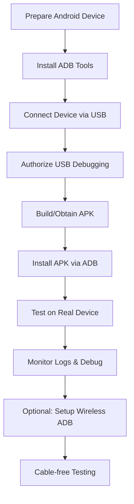

# Android Device Testing Guide

A comprehensive guide for testing mobile applications directly on real Android devices without requiring heavy emulators or powerful development machines.

## 1. Product Overview

This guide provides a complete workflow for setting up and using real Android devices for mobile app testing and debugging. It covers device preparation, ADB setup, connection management, APK deployment, and debugging workflows that enable efficient testing on actual hardware for more accurate performance assessment.

## 2. Core Features

### 2.1 User Roles

| Role | Registration Method | Core Permissions |
|------|---------------------|------------------|
| Mobile Developer | Direct device access | Can install APKs, debug apps, access device logs |
| QA Tester | Device connection setup | Can install and test applications, view basic logs |
| DevOps Engineer | CI/CD integration | Can automate APK deployment and testing workflows |

### 2.2 Feature Module

Our Android device testing workflow consists of the following main components:

1. **Device Preparation**: Developer options activation, USB debugging setup
2. **ADB Installation**: Platform tools setup, environment configuration
3. **Device Connection**: USB connection, authorization, wireless setup
4. **APK Management**: Installation, updates, package management
5. **Testing & Debugging**: Log monitoring, performance testing, troubleshooting
6. **CI/CD Integration**: Automated builds, deployment workflows

### 2.3 Page Details

| Component | Module Name | Feature Description |
|-----------|-------------|--------------------|
| Device Setup | Developer Options | Enable developer mode, configure USB debugging, set installation permissions |
| ADB Installation | Platform Tools | Download Android SDK tools, configure PATH variables, verify installation |
| Device Connection | USB & Wireless | Establish device connection, handle authorization, setup wireless debugging |
| APK Management | Installation & Updates | Install APK files, handle updates, manage app packages and permissions |
| Testing Workflow | Debugging & Monitoring | Real-time log viewing, performance monitoring, crash analysis |
| Automation | CI/CD Integration | GitHub Actions workflows, automated APK building and deployment |

## 3. Core Process

### Developer Workflow
1. Prepare Android device with developer options and USB debugging
2. Install ADB tools on development machine
3. Connect device via USB and authorize debugging
4. Build or obtain APK file from CI/CD pipeline
5. Install APK using ADB commands
6. Test application functionality on real device
7. Monitor logs and debug issues as needed
8. Optionally setup wireless debugging for cable-free testing

### QA Testing Flow
1. Receive APK file from development team
2. Connect authorized testing device
3. Install application using ADB
4. Execute test scenarios on real hardware
5. Monitor application behavior and performance
6. Report issues with log data



## 4. User Interface Design

### 4.1 Design Style
- **Primary Colors**: Terminal green (#00FF00), Android green (#3DDC84)
- **Secondary Colors**: Warning amber (#FFC107), Error red (#F44336)
- **Command Style**: Monospace font for code blocks and terminal commands
- **Layout Style**: Step-by-step guide format with clear section headers
- **Icons**: 🔧 for setup, 💻 for installation, 🔌 for connection, 📦 for APK management, 📱 for testing

### 4.2 Page Design Overview

| Section | Module Name | UI Elements |
|---------|-------------|-------------|
| Device Setup | Step-by-step Guide | Numbered instructions, screenshot placeholders, status indicators |
| ADB Installation | Platform Tools Setup | Download links, installation commands, PATH configuration |
| Connection Management | Device Authorization | Terminal output examples, troubleshooting tips |
| APK Management | Installation Commands | Code blocks, command examples, package information |
| Testing Interface | Debug Console | Log output formatting, filtering options, real-time monitoring |

### 4.3 Responsiveness
The documentation is designed as a desktop-first reference guide optimized for developers working on development machines, with mobile-friendly formatting for quick reference during testing.

---

# Detailed Implementation Guide

## 🔧 Step 1: Prepare Your Android Device

### Enable Developer Options
1. Open **Settings → About phone**
2. Scroll to **Build number**
3. Tap it **7 times** until you see "You are now a developer"

### Enable USB Debugging
1. Go back to **Settings → Developer options**
2. Turn on **USB debugging**
3. (Optional) Enable **Install via USB** if available
4. (Optional) Enable **USB debugging (Security settings)** for system-level debugging

### Additional Recommended Settings
- **Stay awake**: Keep screen on while charging
- **USB configuration**: Set to "File Transfer" or "MTP"
- **Revoke USB debugging authorizations**: Clear previous authorizations if needed

---

## 💻 Step 2: Install ADB (Android Debug Bridge)

### Download Android Platform Tools
1. Download **Android Platform Tools** (~30-50 MB) from official source
2. Extract ZIP to a permanent location:
   - Windows: `C:\platform-tools`
   - macOS/Linux: `~/platform-tools`

### Configure Environment
**Windows:**
```cmd
# Add to PATH via System Properties
# Or use PowerShell temporarily:
$env:PATH += ";C:\platform-tools"
```

**macOS/Linux:**
```bash
# Add to ~/.bashrc or ~/.zshrc
export PATH=$PATH:~/platform-tools

# Reload shell configuration
source ~/.bashrc
```

### Verify Installation
```bash
adb --version
# Should display ADB version information
```

---

## 🔌 Step 3: Connect Your Device

### USB Connection Setup
1. Use a **data cable** (not charging-only)
2. Connect device to computer
3. On device, tap **"Allow USB debugging?"** → **Allow**
4. Check **"Always allow from this computer"** for permanent authorization

### Verify Connection
```bash
adb devices
```

**Expected Output:**
```
List of devices attached
XXXXXXXXXXXX   device
```

**Troubleshooting:**
- `unauthorized`: Check device for authorization prompt
- `no devices`: Check cable, USB port, or driver installation
- `offline`: Restart ADB server with `adb kill-server && adb start-server`

---

## 📦 Step 4: APK Installation & Management

### Install APK
```bash
# Basic installation
adb install app-debug.apk

# Reinstall/update existing app
adb install -r app-debug.apk

# Install with all permissions granted
adb install -g app-debug.apk
```

### Launch Application
```bash
# Launch app (replace with actual package name)
adb shell am start -n com.yourpackagename/.MainActivity

# Launch with specific activity
adb shell am start -n com.yourpackagename/.SplashActivity
```

### Package Management
```bash
# List installed packages
adb shell pm list packages | grep yourapp

# Uninstall app
adb uninstall com.yourpackagename

# Clear app data
adb shell pm clear com.yourpackagename
```

---

## 📱 Step 5: Testing & Debugging

### Real-time Log Monitoring
```bash
# View all logs
adb logcat

# Filter by app package
adb logcat | grep "com.yourpackagename"

# Filter by log level
adb logcat *:E  # Errors only
adb logcat *:W  # Warnings and above

# Clear logs and start fresh
adb logcat -c && adb logcat
```

### Performance Testing
```bash
# Monitor CPU and memory usage
adb shell top | grep yourpackagename

# Capture screenshots
adb shell screencap /sdcard/screenshot.png
adb pull /sdcard/screenshot.png

# Record screen (Android 4.4+)
adb shell screenrecord /sdcard/demo.mp4
```

### File Management
```bash
# Push files to device
adb push local-file.txt /sdcard/

# Pull files from device
adb pull /sdcard/app-data.db ./

# Access device shell
adb shell
```

---

## 🌐 Step 6: Wireless ADB Setup

### Enable Wireless Debugging
```bash
# Connect via USB first, then enable TCP mode
adb tcpip 5555

# Find device IP address
adb shell ip addr show wlan0

# Connect wirelessly (replace with actual IP)
adb connect 192.168.1.100:5555

# Verify wireless connection
adb devices
```

### Wireless Connection Management
```bash
# Disconnect wireless
adb disconnect 192.168.1.100:5555

# Return to USB mode
adb usb

# Connect to multiple devices
adb connect device1-ip:5555
adb connect device2-ip:5555
```

---

## 🚀 Step 7: CI/CD Integration

### GitHub Actions Workflow Example
```yaml
name: Build and Deploy APK

on:
  push:
    branches: [ main, develop ]
  pull_request:
    branches: [ main ]

jobs:
  build:
    runs-on: ubuntu-latest
    
    steps:
    - uses: actions/checkout@v3
    
    - name: Set up JDK 11
      uses: actions/setup-java@v3
      with:
        java-version: '11'
        distribution: 'temurin'
    
    - name: Setup Android SDK
      uses: android-actions/setup-android@v2
    
    - name: Build APK
      run: |
        chmod +x ./gradlew
        ./gradlew assembleDebug
    
    - name: Upload APK
      uses: actions/upload-artifact@v3
      with:
        name: app-debug
        path: app/build/outputs/apk/debug/app-debug.apk
```

### Automated Testing Integration
```yaml
    - name: Run Tests on Device
      run: |
        # Install APK on connected device
        adb install -r app/build/outputs/apk/debug/app-debug.apk
        
        # Run instrumented tests
        ./gradlew connectedAndroidTest
        
        # Collect test results
        adb pull /sdcard/test-results ./
```

---

## 🔧 Troubleshooting Guide

### Common Issues

**Device Not Detected:**
- Verify USB cable supports data transfer
- Install device-specific USB drivers
- Try different USB ports
- Enable "File Transfer" mode on device

**Authorization Problems:**
- Revoke USB debugging authorizations in Developer Options
- Restart ADB server: `adb kill-server && adb start-server`
- Check device screen for authorization prompt

**Installation Failures:**
```bash
# Common solutions
adb install -r -d app.apk  # Allow downgrade
adb install -r -t app.apk  # Allow test APKs
adb uninstall com.package.name && adb install app.apk  # Clean install
```

**Performance Issues:**
- Use `adb shell dumpsys meminfo com.yourpackage` for memory analysis
- Monitor with `adb shell dumpsys cpuinfo`
- Check battery usage: `adb shell dumpsys batterystats`

### Best Practices

1. **Device Management:**
   - Use dedicated testing devices
   - Keep devices charged during testing
   - Regularly clear cache and data

2. **Security:**
   - Only enable USB debugging when needed
   - Use device-specific authorization
   - Disable debugging on production devices

3. **Testing Efficiency:**
   - Use wireless ADB for mobility
   - Automate repetitive installation tasks
   - Maintain multiple device configurations

4. **Log Management:**
   - Filter logs by package name
   - Save important log sessions
   - Use appropriate log levels for debugging

This comprehensive guide enables efficient testing on real Android devices, providing more accurate performance data than emulators while requiring minimal system resources on the development machine.