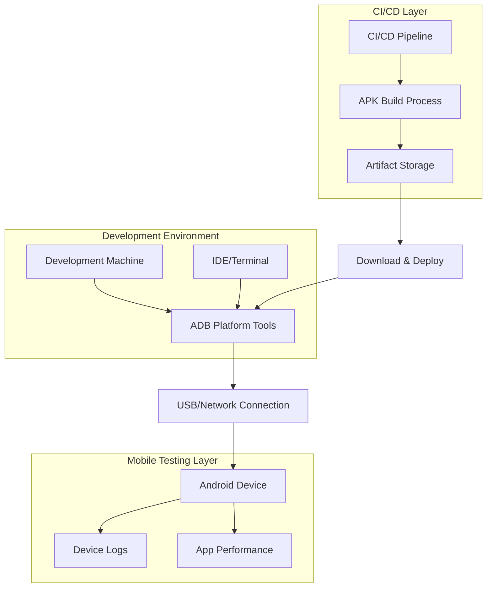
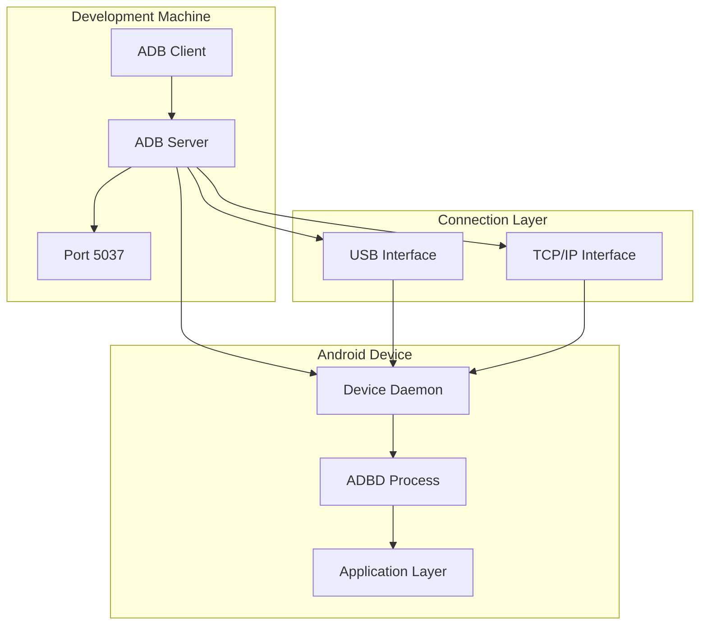
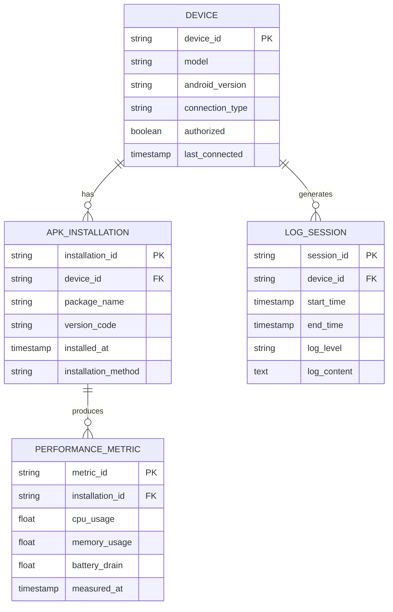

# Android Device Testing - Technical Architecture

## 1. Architecture Design



## 2. Technology Description

- **Development Tools**: Android SDK Platform Tools (ADB, Fastboot)
- **Connection Protocol**: USB Debug Bridge, TCP/IP (Wireless)
- **Build System**: Gradle, GitHub Actions, Expo/EAS Build
- **Testing Framework**: Android Instrumentation, Espresso, Detox
- **Monitoring**: Logcat, Performance Profiler, Memory Analyzer

## 3. Route Definitions

| Component | Purpose |
|-----------|----------|
| ADB Server | Manages communication between development machine and Android devices |
| USB Bridge | Handles physical device connection and data transfer |
| Wireless Bridge | Enables cable-free debugging over TCP/IP connection |
| APK Installer | Manages application installation, updates, and removal |
| Log Monitor | Provides real-time application and system log streaming |
| Performance Profiler | Monitors CPU, memory, and battery usage during testing |

## 4. API Definitions

### 4.1 Core ADB Commands

**Device Management**
```bash
adb devices
```
Response: List of connected devices with their status

**APK Installation**
```bash
adb install [-r] [-g] <apk-file>
```
Parameters:
| Param Name | Param Type | isRequired | Description |
|------------|------------|------------|-------------|
| apk-file | string | true | Path to APK file |
| -r | flag | false | Reinstall existing app |
| -g | flag | false | Grant all permissions |

**Log Monitoring**
```bash
adb logcat [filter-spec]
```
Parameters:
| Param Name | Param Type | isRequired | Description |
|------------|------------|------------|-------------|
| filter-spec | string | false | Log filtering criteria |

Example:
```bash
adb logcat *:E  # Error level logs only
adb logcat | grep "MyApp"  # Filter by app name
```

**File Transfer**
```bash
adb push <local> <remote>
adb pull <remote> <local>
```

### 4.2 Wireless Connection API

**Enable TCP Mode**
```bash
adb tcpip <port>
```

**Connect Wirelessly**
```bash
adb connect <device-ip>:<port>
```

Example:
```json
{
  "command": "adb connect 192.168.1.100:5555",
  "response": "connected to 192.168.1.100:5555"
}
```

## 5. Server Architecture Diagram



## 6. Data Model

### 6.1 Data Model Definition



### 6.2 Configuration Files

**ADB Configuration**
```ini
# ~/.android/adb_usb.ini
# USB Vendor IDs for device recognition
0x04e8  # Samsung
0x22b8  # Motorola
0x0bb4  # HTC
```

**Device Properties**
```bash
# Device information retrieval
adb shell getprop ro.build.version.release  # Android version
adb shell getprop ro.product.model          # Device model
adb shell getprop ro.build.version.sdk      # API level
```

**Testing Configuration**
```yaml
# testing-config.yml
devices:
  - id: "device001"
    model: "Pixel 6"
    android_version: "13"
    test_suites: ["smoke", "regression"]
  - id: "device002"
    model: "Galaxy S21"
    android_version: "12"
    test_suites: ["compatibility"]

test_parameters:
  timeout: 300
  retry_count: 3
  log_level: "INFO"
```

**CI/CD Integration Schema**
```yaml
# GitHub Actions workflow data structure
workflow:
  name: "Android Device Testing"
  triggers:
    - push
    - pull_request
  jobs:
    build:
      steps:
        - checkout
        - setup_java
        - build_apk
        - upload_artifacts
    test:
      needs: build
      steps:
        - download_apk
        - connect_devices
        - install_apk
        - run_tests
        - collect_results
```

This technical architecture provides the foundation for implementing robust Android device testing workflows, supporting both manual testing scenarios and automated CI/CD integration.