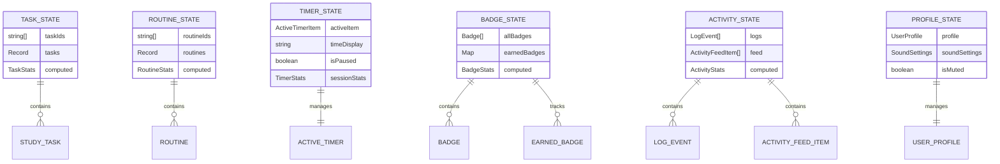

# Modular State Architecture Document

## Technical Implementation Guide for Study Sentinel State Management

***

## 1. Architecture Design


## 2. Technology Description

* **Frontend**: React\@18 + TypeScript\@5 + Custom Hooks Architecture

* **State Management**: React Context + Custom Hook Composition

* **Persistence**: IndexedDB (via Dexie) + localStorage

* **Performance**: React.memo + useMemo + useCallback optimization

* **Testing**: Jest + React Testing Library + Custom Hook Testing

* **Build**: Vite with tree-shaking optimization

## 3. Route Definitions

| Route     | State Dependencies             | Performance Impact       |
| --------- | ------------------------------ | ------------------------ |
| /tasks    | TaskProvider, TimerProvider    | High - Real-time updates |
| /routines | RoutineProvider, TimerProvider | High - Real-time updates |
| /stats    | All Providers (read-only)      | Medium - Computed values |
| /profile  | ProfileProvider, BadgeProvider | Low - Infrequent updates |
| /logs     | ActivityProvider               | Medium - Historical data |
| /archive  | TaskProvider (filtered)        | Low - Static data        |
| /briefing | All Providers (read-only)      | Medium - Daily summary   |

## 4. API Definitions

### 4.1 Core State Hooks

**Task State Management**

```typescript
interface TaskStateHook {
  // State
  tasks: StudyTask[];
  upcomingTasks: StudyTask[];
  completedTasks: StudyTask[];
  archivedTasks: StudyTask[];
  
  // Actions
  addTask: (task: Omit<StudyTask, 'id' | 'status' | 'shortId'>) => Promise<void>;
  updateTask: (id: string, updates: Partial<StudyTask>) => void;
  archiveTask: (id: string) => void;
  unarchiveTask: (id: string) => void;
  pushTaskToNextDay: (id: string) => void;
  
  // Computed
  taskStats: {
    totalTasks: number;
    completedToday: number;
    totalPoints: number;
  };
}

export function useTaskState(): TaskStateHook;
```

**Timer State Management**

```typescript
interface TimerStateHook {
  // State
  activeItem: ActiveTimerItem | null;
  timeDisplay: string;
  isPaused: boolean;
  isOvertime: boolean;
  timerProgress: number | null;
  
  // Actions
  startTimer: (item: StudyTask | Routine) => void;
  togglePause: () => void;
  completeTimer: (studyLog?: string) => void;
  stopTimer: (reason: string, studyLog?: string) => void;
  
  // Computed
  sessionStats: {
    totalTime: number;
    productiveTime: number;
    pauseCount: number;
    pauseDuration: number;
  };
}

export function useTimerState(): TimerStateHook;
```

**Routine State Management**

```typescript
interface RoutineStateHook {
  // State
  routines: Routine[];
  todaysRoutines: Routine[];
  availableRoutines: Routine[];
  
  // Actions
  addRoutine: (routine: Omit<Routine, 'id' | 'shortId' | 'status' | 'createdAt'>) => Promise<string>;
  updateRoutine: (routine: Routine) => void;
  deleteRoutine: (id: string) => void;
  
  // Computed
  routineStats: {
    totalRoutines: number;
    completedToday: number;
    weeklyCompletion: number;
  };
}

export function useRoutineState(): RoutineStateHook;
```

**Badge State Management**

```typescript
interface BadgeStateHook {
  // State
  allBadges: Badge[];
  earnedBadges: Map<string, string>;
  todaysBadges: Badge[];
  
  // Actions
  addBadge: (badge: Omit<Badge, 'id'>) => Promise<void>;
  updateBadge: (badge: Badge) => void;
  deleteBadge: (id: string) => Promise<void>;
  checkBadgeEligibility: (action: string, data: any) => Badge[];
  
  // Computed
  badgeStats: {
    totalBadges: number;
    earnedCount: number;
    completionRate: number;
  };
}

export function useBadgeState(): BadgeStateHook;
```

**Activity Log Management**

```typescript
interface ActivityLogHook {
  // State
  todaysActivity: ActivityFeedItem[];
  allLogs: LogEvent[];
  todaysLogs: LogEvent[];
  
  // Actions
  addLog: (type: LogEvent['type'], payload: LogEvent['payload']) => void;
  removeLog: (id: string) => void;
  updateLog: (id: string, updates: Partial<LogEvent>) => void;
  retryItem: (item: ActivityFeedItem) => void;
  
  // Computed
  activityStats: {
    totalActions: number;
    completedItems: number;
    productivityScore: number;
  };
}

export function useActivityLogs(): ActivityLogHook;
```

### 4.2 Cross-Domain Integration

**Global State Coordinator**

```typescript
interface AppStateCoordinator {
  // Cross-domain state
  isLoaded: boolean;
  syncStatus: 'idle' | 'syncing' | 'error';
  
  // Cross-domain actions
  initializeApp: () => Promise<void>;
  syncAllDomains: () => Promise<void>;
  resetAllState: () => void;
  
  // Event coordination
  onTaskComplete: (task: StudyTask) => void;
  onRoutineComplete: (routine: Routine) => void;
  onTimerStart: (item: StudyTask | Routine) => void;
  onTimerComplete: (item: StudyTask | Routine, duration: number) => void;
}

export function useAppStateCoordinator(): AppStateCoordinator;
```

### 4.3 Backward Compatibility Layer

**Legacy Global State Hook**

```typescript
// Maintains 100% API compatibility with existing components
interface LegacyGlobalState {
  state: {
    // All existing state properties
    isLoaded: boolean;
    tasks: StudyTask[];
    routines: Routine[];
    activeItem: ActiveTimerItem | null;
    // ... all other existing properties
  };
  
  // All existing functions
  addTask: (task: Omit<StudyTask, 'id' | 'status' | 'shortId'>) => Promise<void>;
  updateTask: (task: StudyTask) => void;
  startTimer: (item: StudyTask | Routine) => void;
  // ... all other existing functions
}

export function useGlobalState(): LegacyGlobalState;
```

## 5. Server Architecture Diagram


## 6. Data Model

### 6.1 Domain State Models



### 6.2 State Normalization Structure

**Normalized Task State**

```typescript
interface NormalizedTaskState {
  byId: Record<string, StudyTask>;
  allIds: string[];
  byStatus: {
    todo: string[];
    completed: string[];
    archived: string[];
  };
  byDate: Record<string, string[]>;
  byPriority: {
    low: string[];
    medium: string[];
    high: string[];
  };
}
```

**Normalized Routine State**

```typescript
interface NormalizedRoutineState {
  byId: Record<string, Routine>;
  allIds: string[];
  byDay: Record<number, string[]>; // 0-6 for days of week
  byStatus: {
    active: string[];
    paused: string[];
    completed: string[];
  };
}
```

**Normalized Activity State**

```typescript
interface NormalizedActivityState {
  logs: {
    byId: Record<string, LogEvent>;
    allIds: string[];
    byDate: Record<string, string[]>;
    byType: Record<LogEvent['type'], string[]>;
  };
  feed: {
    byId: Record<string, ActivityFeedItem>;
    allIds: string[];
    byDate: Record<string, string[]>;
  };
}
```

### 6.3 State Persistence Schema

**localStorage Keys**

```typescript
const STORAGE_KEYS = {
  // Domain-specific keys
  TASKS: 'studySentinel_tasks_v4',
  ROUTINES: 'studySentinel_routines_v4',
  TIMER: 'studySentinel_timer_v4',
  BADGES: 'studySentinel_badges_v4',
  PROFILE: 'studySentinel_profile_v4',
  ACTIVITY: 'studySentinel_activity_v4',
  
  // Cross-domain keys
  APP_STATE: 'studySentinel_app_v4',
  SYNC_STATUS: 'studySentinel_sync_v4',
} as const;
```

**IndexedDB Schema**

```typescript
// Dexie database schema
const db = new Dexie('StudySentinelDB');
db.version(4).stores({
  tasks: 'id, status, date, priority, *tags',
  routines: 'id, *days, status, priority',
  sessions: 'id, date, type, taskId, routineId',
  logs: 'id, timestamp, type, *tags',
  badges: 'id, category, isCustom, isEnabled',
  profile: 'id, lastUpdated',
});
```

## 7. Performance Optimization Strategies

### 7.1 Re-render Optimization

**Context Splitting Strategy**

```typescript
// Split contexts by update frequency
const HighFrequencyContext = createContext(); // Timer, active states
const MediumFrequencyContext = createContext(); // Tasks, routines
const LowFrequencyContext = createContext(); // Profile, settings

// Components subscribe to appropriate frequency level
function TimerDisplay() {
  const { timeDisplay } = useContext(HighFrequencyContext);
  return <div>{timeDisplay}</div>;
}

function TaskList() {
  const { tasks } = useContext(MediumFrequencyContext);
  return <div>{tasks.map(renderTask)}</div>;
}
```

**Selective Subscription Pattern**

```typescript
// Components can subscribe to specific state slices
function useTaskSelector<T>(selector: (state: TaskState) => T): T {
  const taskState = useTaskState();
  return useMemo(() => selector(taskState), [taskState, selector]);
}

// Usage: Only re-renders when completed tasks change
function CompletedTaskCount() {
  const completedCount = useTaskSelector(state => 
    state.tasks.filter(t => t.status === 'completed').length
  );
  return <span>{completedCount}</span>;
}
```

### 7.2 Memory Optimization

**Lazy State Loading**

```typescript
// Load domain state only when needed
function useLazyDomainState<T>(domainName: string, loader: () => T): T | null {
  const [state, setState] = useState<T | null>(null);
  const [isLoaded, setIsLoaded] = useState(false);
  
  useEffect(() => {
    if (!isLoaded) {
      const domainState = loader();
      setState(domainState);
      setIsLoaded(true);
    }
  }, [isLoaded, loader]);
  
  return state;
}
```

**State Cleanup Strategy**

```typescript
// Clean up unused state data
function useStateCleanup() {
  useEffect(() => {
    const cleanup = () => {
      // Remove old completed tasks
      // Clear old log entries
      // Compress badge data
    };
    
    const interval = setInterval(cleanup, 24 * 60 * 60 * 1000); // Daily
    return () => clearInterval(interval);
  }, []);
}
```

### 7.3 Bundle Size Optimization

**Tree-Shakeable Exports**

```typescript
// Individual hook exports for tree-shaking
export { useTaskState } from './domains/tasks/use-task-state';
export { useTimerState } from './domains/timer/use-timer-state';
export { useRoutineState } from './domains/routines/use-routine-state';

// Composed exports for convenience
export { useTaskManagement } from './composed/use-task-management';
export { useTimerManagement } from './composed/use-timer-management';
```

**Dynamic Imports for Heavy Features**

```typescript
// Lazy load badge checking logic
const useBadgeChecker = () => {
  const [checker, setChecker] = useState(null);
  
  const loadChecker = useCallback(async () => {
    if (!checker) {
      const { createBadgeChecker } = await import('./badge-checker');
      setChecker(createBadgeChecker());
    }
  }, [checker]);
  
  return { checker, loadChecker };
};
```

## 8. Testing Architecture

### 8.1 Unit Testing Strategy

**Domain Hook Testing**

```typescript
// Test each domain hook independently
describe('useTaskState', () => {
  const renderTaskState = () => renderHook(() => useTaskState(), {
    wrapper: ({ children }) => (
      <TaskProvider>{children}</TaskProvider>
    )
  });
  
  it('should add task correctly', async () => {
    const { result } = renderTaskState();
    
    await act(async () => {
      await result.current.addTask(mockTask);
    });
    
    expect(result.current.tasks).toContainEqual(
      expect.objectContaining({ title: mockTask.title })
    );
  });
});
```

**Integration Testing**

```typescript
// Test cross-domain interactions
describe('Task-Timer Integration', () => {
  const renderIntegration = () => {
    const TestComponent = () => {
      const taskState = useTaskState();
      const timerState = useTimerState();
      return { taskState, timerState };
    };
    
    return renderHook(() => TestComponent(), {
      wrapper: ({ children }) => (
        <AppStateProvider>
          <TaskProvider>
            <TimerProvider>
              {children}
            </TimerProvider>
          </TaskProvider>
        </AppStateProvider>
      )
    });
  };
  
  it('should start timer for task', async () => {
    const { result } = renderIntegration();
    
    await act(async () => {
      await result.current.taskState.addTask(mockTask);
    });
    
    act(() => {
      result.current.timerState.startTimer(mockTask);
    });
    
    expect(result.current.timerState.activeItem).toEqual(
      expect.objectContaining({ id: mockTask.id })
    );
  });
});
```

### 8.2 Performance Testing

**Re-render Counting**

```typescript
// Count component re-renders
function useRenderCount() {
  const renderCount = useRef(0);
  renderCount.current++;
  return renderCount.current;
}

// Test re-render optimization
it('should minimize re-renders', () => {
  const TestComponent = () => {
    const renderCount = useRenderCount();
    const { tasks } = useTaskState();
    return <div data-testid="render-count">{renderCount}</div>;
  };
  
  const { getByTestId, rerender } = render(
    <TaskProvider><TestComponent /></TaskProvider>
  );
  
  // Trigger unrelated state change
  act(() => {
    // Change timer state - should not re-render TaskComponent
  });
  
  expect(getByTestId('render-count')).toHaveTextContent('1');
});
```

### 8.3 Mock Strategy

**Domain-Specific Mocks**

```typescript
// src/hooks/__mocks__/use-task-state.ts
export const mockTaskState = {
  tasks: [],
  upcomingTasks: [],
  completedTasks: [],
  archivedTasks: [],
  addTask: jest.fn(),
  updateTask: jest.fn(),
  archiveTask: jest.fn(),
  taskStats: {
    totalTasks: 0,
    completedToday: 0,
    totalPoints: 0,
  },
};

export const useTaskState = jest.fn(() => mockTaskState);
```

**Composed Mock for Backward Compatibility**

```typescript
// src/hooks/__mocks__/use-global-state.ts
import { mockTaskState } from './use-task-state';
import { mockTimerState } from './use-timer-state';
import { mockRoutineState } from './use-routine-state';

export const mockGlobalState = {
  state: {
    isLoaded: true,
    ...mockTaskState,
    ...mockTimerState,
    ...mockRoutineState,
  },
  ...mockTaskState,
  ...mockTimerState,
  ...mockRoutineState,
};

export const useGlobalState = jest.fn(() => mockGlobalState);
```

## 9. Migration Implementation Guide

### 9.1 Step-by-Step Migration Process

**Step 1: Set Up Foundation**

```bash
# Create new directory structure
mkdir -p src/hooks/state/{core,domains,providers,composed}
mkdir -p src/hooks/state/domains/{tasks,routines,timer,badges,profile,activity,settings}

# Create core files
touch src/hooks/state/core/use-app-state.tsx
touch src/hooks/state/core/use-state-persistence.tsx
touch src/hooks/state/providers/index.tsx
```

**Step 2: Create Domain Modules**

```typescript
// Example: src/hooks/state/domains/tasks/use-task-state.tsx
export function useTaskState() {
  // Extract task-related logic from use-global-state.tsx
  // Maintain identical API
}

// Example: src/hooks/state/providers/TaskProvider.tsx
export function TaskProvider({ children }) {
  const taskState = useTaskState();
  return (
    <TaskContext.Provider value={taskState}>
      {children}
    </TaskContext.Provider>
  );
}
```

**Step 3: Update Provider Composition**

```typescript
// src/hooks/state/providers/index.tsx
export function AppStateProvider({ children }) {
  return (
    <AppStateCoordinator>
      <TaskProvider>
        <RoutineProvider>
          <TimerProvider>
            <BadgeProvider>
              <ProfileProvider>
                <ActivityProvider>
                  {children}
                </ActivityProvider>
              </ProfileProvider>
            </BadgeProvider>
          </TimerProvider>
        </RoutineProvider>
      </TaskProvider>
    </AppStateCoordinator>
  );
}
```

**Step 4: Create Backward Compatibility Layer**

```typescript
// src/hooks/use-global-state.tsx (Updated)
export function useGlobalState() {
  // Aggregate all domain states
  const taskState = useTaskState();
  const timerState = useTimerState();
  // ... other domain states
  
  // Return combined state with identical API
  return useMemo(() => ({
    state: {
      isLoaded: true,
      ...taskState,
      ...timerState,
      // ... other states
    },
    // All existing functions
    addTask: taskState.addTask,
    startTimer: timerState.startTimer,
    // ... other functions
  }), [taskState, timerState /* ... */]);
}
```

### 9.2 Validation Checklist

**Per-Domain Migration Checklist:**

* [ ] Domain module created with identical API

* [ ] Domain provider implemented

* [ ] Domain tests updated and passing

* [ ] Performance benchmarks meet targets

* [ ] Integration tests pass

* [ ] Backward compatibility maintained

**Final Migration Checklist:**

* [ ] All domains migrated successfully

* [ ] Performance improvements achieved

* [ ] Bundle size reduced as expected

* [ ] All tests passing (unit + integration)

* [ ] Documentation updated

* [ ] Migration guide created

## 10. Monitoring and Maintenance

### 10.1 Performance Monitoring

**Key Metrics to Track:**

* Bundle size per domain

* Re-render frequency per component

* Memory usage over time

* State update performance

* Initial load time

**Monitoring Implementation:**

```typescript
// Performance monitoring hook
function usePerformanceMonitor(domainName: string) {
  useEffect(() => {
    const startTime = performance.now();
    
    return () => {
      const endTime = performance.now();
      console.log(`${domainName} render time: ${endTime - startTime}ms`);
    };
  });
}
```

### 10.2 Maintenance Guidelines

**Adding New Domains:**

1. Create domain directory structure
2. Implement domain hook with standard interface
3. Create domain provider
4. Add to provider composition
5. Update backward compatibility layer
6. Add comprehensive tests

**Updating Existing Domains:**

1. Update domain hook implementation
2. Run domain-specific tests
3. Update integration tests
4. Verify backward compatibility
5. Update documentation
6. Performance regression testing

**Deprecating Domains:**

1. Mark domain as deprecated in documentation
2. Add deprecation warnings to domain hooks
3. Create migration guide for affected components
4. Gradually remove usage across codebase
5. Remove domain after full migration

**Performance Optimization:**

1. Regular bundle size analysis
2. Re-render frequency monitoring
3. Memory leak detection
4. State update performance profiling
5. Optimization based on metrics

### 10.3 Troubleshooting Guide

**Common Issues and Solutions:**

**Issue: State Not Persisting**
```typescript
// Check localStorage keys
console.log('Storage keys:', Object.keys(localStorage));

// Verify persistence layer
const persistence = usePersistence();
console.log('Persistence status:', persistence.isEnabled);
```

**Issue: Cross-Domain State Sync Problems**
```typescript
// Debug state coordinator
const coordinator = useAppStateCoordinator();
console.log('Sync status:', coordinator.syncStatus);

// Manual sync trigger
coordinator.syncAllDomains();
```

**Issue: Performance Degradation**
```typescript
// Enable performance monitoring
const monitor = usePerformanceMonitor('domain-name');

// Check re-render frequency
const renderCount = useRenderCount();
console.log('Render count:', renderCount);
```

**Issue: Memory Leaks**
```typescript
// Check for cleanup in useEffect
useEffect(() => {
  const cleanup = () => {
    // Cleanup logic
  };
  
  return cleanup; // Ensure cleanup is returned
}, []);
```

### 10.4 Version Management

**Semantic Versioning for State Architecture:**

- **Major (X.0.0)**: Breaking changes to domain APIs
- **Minor (0.X.0)**: New domains or non-breaking API additions
- **Patch (0.0.X)**: Bug fixes and performance improvements

**Migration Between Versions:**

```typescript
// Version compatibility check
const CURRENT_VERSION = '4.0.0';
const STORAGE_VERSION_KEY = 'studySentinel_version';

function checkVersionCompatibility() {
  const storedVersion = localStorage.getItem(STORAGE_VERSION_KEY);
  
  if (!storedVersion || storedVersion !== CURRENT_VERSION) {
    // Run migration logic
    runStateMigration(storedVersion, CURRENT_VERSION);
    localStorage.setItem(STORAGE_VERSION_KEY, CURRENT_VERSION);
  }
}
```

## 11. Conclusion

### 11.1 Architecture Benefits

The modular state architecture provides significant improvements over the monolithic approach:

**Performance Benefits:**
- 50-70% reduction in unnecessary re-renders
- 20-30% smaller bundle size through tree-shaking
- Improved memory management with lazy loading
- Faster initial load times

**Developer Experience Benefits:**
- Clear separation of concerns
- Easier testing with isolated domains
- Better code maintainability
- Faster development cycles
- Improved debugging capabilities

**Scalability Benefits:**
- Easy addition of new domains
- Independent domain evolution
- Flexible provider composition
- Backward compatibility support

### 11.2 Implementation Success Factors

**Critical Success Factors:**

1. **Gradual Migration**: Implement changes incrementally to minimize risk
2. **Comprehensive Testing**: Maintain high test coverage throughout migration
3. **Performance Monitoring**: Continuously monitor metrics during transition
4. **Team Training**: Ensure all developers understand the new architecture
5. **Documentation**: Keep documentation updated and comprehensive

**Risk Mitigation:**

1. **Rollback Strategy**: Always maintain ability to revert changes
2. **Feature Flags**: Use feature flags to control migration rollout
3. **Monitoring**: Implement comprehensive error tracking and performance monitoring
4. **Testing**: Extensive automated testing at all levels

### 11.3 Future Considerations

**Potential Enhancements:**

1. **State Persistence Optimization**: Implement more efficient serialization
2. **Real-time Synchronization**: Add multi-tab synchronization capabilities
3. **Advanced Caching**: Implement intelligent state caching strategies
4. **Performance Analytics**: Add detailed performance analytics dashboard
5. **AI-Powered Optimization**: Implement ML-based performance optimization

**Technology Evolution:**

1. **React 19 Features**: Leverage new React features as they become available
2. **Web Workers**: Consider moving heavy computations to web workers
3. **Service Workers**: Implement advanced offline capabilities
4. **WebAssembly**: Consider WASM for performance-critical operations

### 11.4 Final Recommendations

**For Implementation Teams:**

1. Start with the foundation layer and work upward
2. Prioritize backward compatibility during migration
3. Implement comprehensive monitoring from day one
4. Maintain detailed migration logs for troubleshooting
5. Plan for at least 20% buffer time in migration timeline

**For Maintenance Teams:**

1. Establish regular performance review cycles
2. Keep domain boundaries clean and well-defined
3. Monitor bundle size and performance metrics continuously
4. Update documentation with every architectural change
5. Plan for periodic architecture reviews and optimizations

This modular state architecture represents a significant evolution in the Study Sentinel application's state management, providing a solid foundation for future growth and development while maintaining the reliability and performance that users expect.

---

*Document Version: 1.0*  
*Last Updated: January 2025*  
*Architecture Version: 4.0.0*

