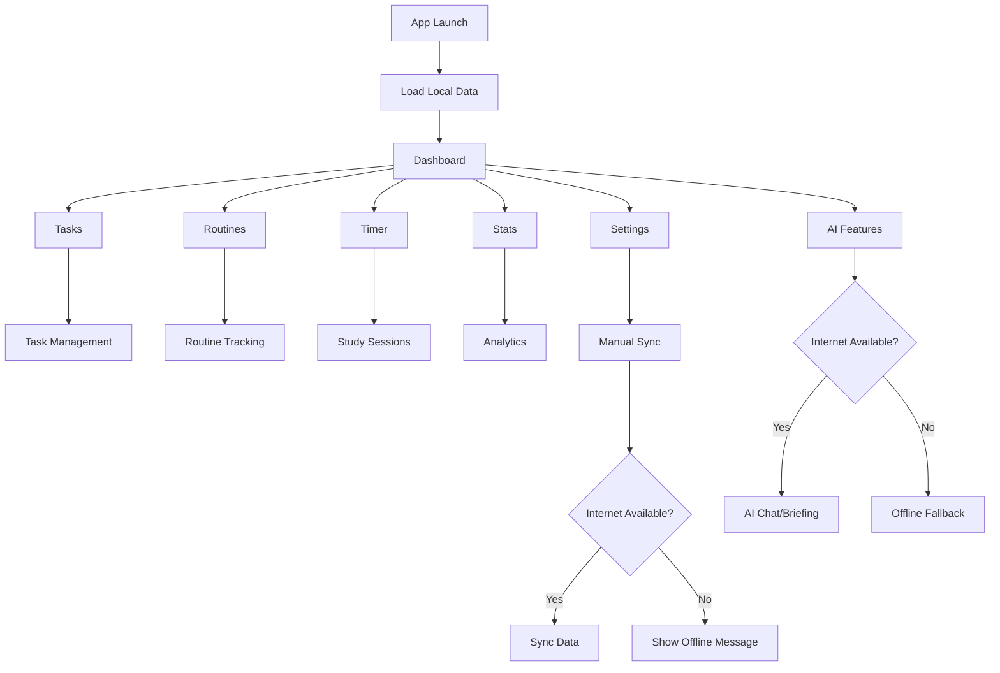

# Study Sentinel Offline-First Development Plan

## 1. Product Overview

Transform Study Sentinel into a completely offline-first native-like Progressive Web App that functions without internet connectivity for all core functionality. The application will only require internet access for AI-powered features (daily briefing and chat) and manual data synchronization.

- The product solves the problem of dependency on internet connectivity for productivity tracking, allowing students to maintain their study habits regardless of network availability.
- Target users are students and professionals who need reliable offline access to their productivity tools in environments with poor or no internet connectivity.
- Market value: Enhanced user experience with native app-like reliability and performance, increased user retention through consistent availability.

## 2. Core Features

### 2.1 User Roles

| Role | Registration Method | Core Permissions |
|------|---------------------|------------------|
| Student User | Local profile creation (no authentication required) | Full access to all offline features, optional sync for backup |

### 2.2 Feature Module

Our offline-first Study Sentinel consists of the following main pages:
1. **Dashboard**: Task overview, routine widgets, daily stats, offline-capable widgets
2. **Tasks**: Task management, creation, editing, completion tracking
3. **Routines**: Routine management, scheduling, progress tracking
4. **Timer**: Pomodoro timer, session tracking, wake lock support
5. **Stats**: Performance analytics, charts, streak tracking
6. **Badges**: Achievement system, progress visualization
7. **Activity Log**: Session activity tracking, detailed logs
8. **Settings**: App configuration, manual sync controls, offline preferences
9. **AI Chat**: Optional online-only positive psychology chatbot
10. **Daily Briefing**: Optional online-only AI-generated performance summary

### 2.3 Page Details

| Page Name | Module Name | Feature description |
|-----------|-------------|---------------------|
| Dashboard | Task Overview | Display active tasks, upcoming deadlines, progress indicators with offline data |
| Dashboard | Routine Widgets | Show routine schedules, completion status, next sessions |
| Dashboard | Stats Summary | Display daily/weekly stats, streaks, achievements from local data |
| Dashboard | Offline Status | Show sync status, last sync time, pending changes indicator |
| Tasks | Task Management | Create, edit, delete, complete tasks with offline persistence |
| Tasks | Priority System | Set task priorities with visual indicators, offline sorting |
| Tasks | Due Date Tracking | Manage deadlines, notifications, overdue indicators |
| Routines | Routine Builder | Create custom study routines with offline scheduling |
| Routines | Session Tracking | Track routine completion, progress, statistics |
| Timer | Pomodoro Timer | 25-minute focus sessions with break intervals, offline operation |
| Timer | Session Logging | Automatic activity logging, time tracking, productivity metrics |
| Timer | Wake Lock | Prevent device sleep during active sessions |
| Stats | Performance Analytics | Generate charts, trends, productivity insights from local data |
| Stats | Streak Tracking | Monitor study streaks, consistency metrics |
| Stats | Time Analysis | Analyze productive hours, session patterns |
| Badges | Achievement System | Unlock badges based on offline activities, progress milestones |
| Badges | Progress Visualization | Display earned badges, upcoming achievements |
| Activity Log | Session History | Detailed log of all user activities, timestamps |
| Activity Log | Export Functionality | Export logs for external analysis (offline capable) |
| Settings | Sound Configuration | Manage timer sounds, notification preferences |
| Settings | Sync Controls | Manual sync button, sync status, conflict resolution |
| Settings | Offline Preferences | Configure offline behavior, data retention policies |
| AI Chat | Chatbot Interface | Online-only positive psychology assistant with graceful offline degradation |
| AI Chat | Context Awareness | Provide study context to AI when online |
| Daily Briefing | Performance Summary | Online-only AI-generated daily performance analysis |
| Daily Briefing | Offline Fallback | Show cached summary or basic stats when offline |

## 3. Core Process

### Main User Flow (Offline-First)
1. User opens application (works immediately offline)
2. User manages tasks, routines, and tracks study sessions (all offline)
3. User views stats and achievements (generated from local data)
4. User optionally syncs data when internet is available
5. User accesses AI features only when online

### Sync Flow
1. User navigates to Settings page
2. User taps "Sync Now" button
3. Application pushes local changes to server
4. Application pulls remote changes and resolves conflicts
5. User receives sync completion notification

## 4. User Interface Design

### 4.1 Design Style
- Primary colors: Blue (#3B82F6) for active elements, Green (#10B981) for success states
- Secondary colors: Gray (#6B7280) for inactive elements, Red (#EF4444) for offline indicators
- Button style: Rounded corners with subtle shadows, 3D effect for primary actions
- Font: Inter font family, 16px base size for readability
- Layout style: Card-based design with clean spacing, top navigation with bottom tab bar
- Icons: Lucide React icons with offline/online status indicators

### 4.2 Page Design Overview

| Page Name | Module Name | UI Elements |
|-----------|-------------|-------------|
| Dashboard | Offline Status | Status chip showing sync state, last sync time, pending changes count |
| Dashboard | Task Cards | Priority-colored cards with offline completion tracking |
| Settings | Sync Section | Manual sync button, progress indicator, sync history |
| Settings | Offline Config | Toggle for offline mode, data retention settings |
| AI Chat | Offline State | Disabled input with "Connect to internet" message |
| Daily Briefing | Offline Fallback | Cached content or basic stats with "Update online" prompt |

### 4.3 Responsiveness
Desktop-first design with mobile-adaptive layout, optimized for touch interactions on mobile devices. PWA installation prompts for native app experience.

## 5. Technical Requirements

### 5.1 Offline-First Architecture
- Enhanced IndexedDB usage for all application data
- Service Worker with comprehensive caching strategies
- Background sync for automatic data synchronization
- Conflict resolution for concurrent data changes

### 5.2 Network Dependencies (Optional)
- AI features (daily briefing, chat) - graceful degradation when offline
- Manual data synchronization - user-initiated only
- PWA updates - background updates when available

### 5.3 Data Persistence
- All core functionality data stored in IndexedDB
- UI preferences migrated from localStorage to IndexedDB
- Outbox pattern for offline change tracking
- Automatic data backup during sync operations

### 5.4 Performance Optimization
- Lazy loading for non-critical features
- Optimistic UI updates for immediate feedback
- Background processing for data calculations
- Memory-efficient data structures for large datasets

## 6. Implementation Phases

### Phase 1: Core Offline Infrastructure (Week 1-2)
- Enhance service worker caching strategies
- Implement comprehensive offline detection
- Migrate localStorage to IndexedDB
- Add offline status indicators

### Phase 2: Manual Sync Implementation (Week 3-4)
- Create sync controls in settings
- Implement manual sync functionality
- Add conflict resolution mechanisms
- Create sync status feedback system

### Phase 3: AI Feature Graceful Degradation (Week 5-6)
- Implement offline fallbacks for AI features
- Add "connect to internet" prompts
- Cache AI responses for offline viewing
- Create offline-friendly alternatives

### Phase 4: PWA Enhancement (Week 7-8)
- Optimize PWA manifest for native experience
- Implement app installation prompts
- Add offline-first onboarding flow
- Enhance performance and caching

### Phase 5: Testing and Optimization (Week 9-10)
- Comprehensive offline testing
- Performance optimization
- User experience refinement
- Documentation and deployment

## 7. Success Metrics

- 100% core functionality available offline
- < 2 seconds app launch time when offline
- Seamless sync experience with conflict resolution
- Native app-like user experience
- Zero data loss during offline usage
- Graceful degradation for online-only features