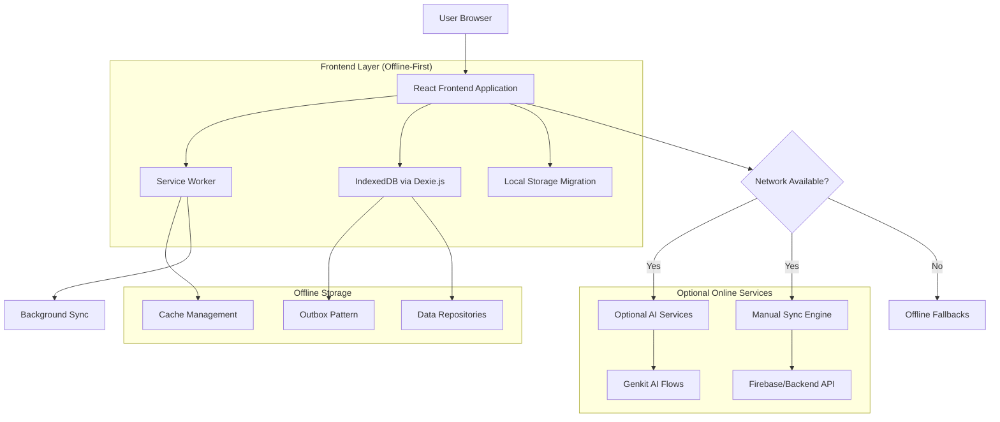
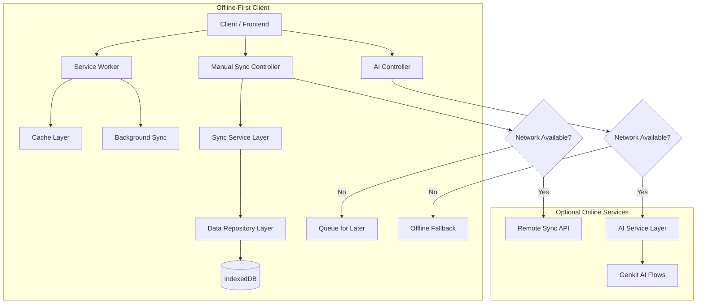
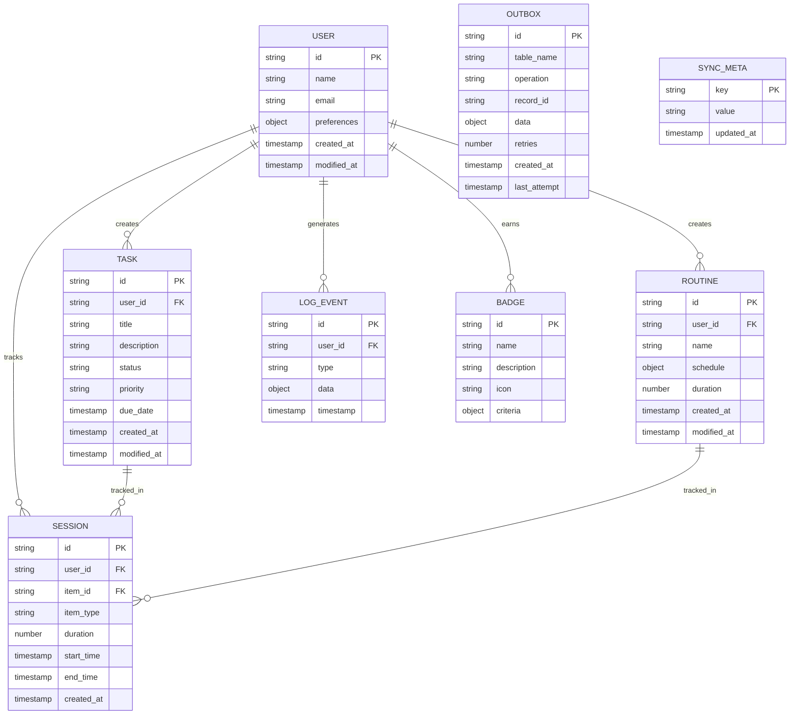

# Study Sentinel Offline-First Technical Architecture

## 1. Architecture Design



## 2. Technology Description

- Frontend: React@18 + TypeScript + Tailwind CSS + Vite
- Data Layer: Dexie.js (IndexedDB) + Repository Pattern
- Offline Support: Service Worker + Background Sync + Outbox Pattern
- State Management: React Context (useGlobalState)
- Optional Services: Genkit AI + Firebase (sync only)
- PWA: Enhanced manifest + Installation prompts

## 3. Route Definitions

| Route | Purpose | Offline Support |
|-------|---------|----------------|
| / | Dashboard with task overview and widgets | Full offline |
| /tasks | Task management and creation | Full offline |
| /routines | Routine management and tracking | Full offline |
| /timer | Pomodoro timer and session tracking | Full offline |
| /stats | Performance analytics and charts | Full offline |
| /badges | Achievement system and progress | Full offline |
| /logs | Activity log and session history | Full offline |
| /settings | App configuration and sync controls | Full offline |
| /chat | AI chatbot interface | Online only with fallback |
| /briefing | AI daily performance summary | Online only with cache |

## 4. API Definitions

### 4.1 Core Offline APIs

Data Repository Interface (Local)
```typescript
interface BaseRepository<T, TKey> {
  getAll(): Promise<T[]>
  getById(id: TKey): Promise<T | undefined>
  add(item: T): Promise<TKey | undefined>
  update(id: TKey, changes: Partial<T>): Promise<void>
  delete(id: TKey): Promise<void>
}
```

Sync Engine Interface
```typescript
interface SyncEngine {
  synchronize(): Promise<void>
  getSyncStatus(): SyncStatus
  start(): void
  stop(): void
}

type SyncStatus = 'Syncing...' | 'Up to date' | 'Offline' | 'Error'
```

### 4.2 Optional Online APIs

Manual Sync API
```
POST /api/sync/push
```

Request:
| Param Name | Param Type | isRequired | Description |
|------------|------------|------------|-------------|
| changes | OutboxItem[] | true | Array of local changes to push |
| timestamp | number | true | Last sync timestamp |

Response:
| Param Name | Param Type | Description |
|------------|------------|-------------|
| success | boolean | Sync operation status |
| conflicts | ConflictItem[] | Array of conflicting items |

```
GET /api/sync/pull
```

Request:
| Param Name | Param Type | isRequired | Description |
|------------|------------|------------|-------------|
| since | number | false | Timestamp for delta sync |

Response:
| Param Name | Param Type | Description |
|------------|------------|-------------|
| changes | ChangeItem[] | Array of remote changes |
| timestamp | number | Current server timestamp |

AI Features API (Optional)
```
POST /api/ai/chat
```

Request:
| Param Name | Param Type | isRequired | Description |
|------------|------------|------------|-------------|
| message | string | true | User message |
| context | UserContext | true | Study context data |

Response:
| Param Name | Param Type | Description |
|------------|------------|-------------|
| response | string | AI-generated response |
| cached | boolean | Whether response was cached |

## 5. Server Architecture Diagram



## 6. Data Model

### 6.1 Data Model Definition



### 6.2 Data Definition Language

Enhanced IndexedDB Schema (Dexie.js)
```typescript
// Enhanced database schema for offline-first operation
class StudySentinelDB extends Dexie {
  plans!: Table<StudyTask, string>
  users!: Table<UserProfile, string>
  sessions!: Table<Session, string>
  stats_daily!: Table<DailyStats, string>
  meta!: Table<MetaData, string>
  outbox!: Table<Outbox, string>
  routines!: Table<Routine, string>
  logs!: Table<LogEvent, string>
  badges!: Table<Badge, string>
  
  // New tables for offline-first functionality
  sync_conflicts!: Table<SyncConflict, string>
  cached_ai_responses!: Table<CachedAIResponse, string>
  user_preferences!: Table<UserPreference, string>

  constructor() {
    super('StudySentinelDB')
    this.version(2).stores({
      plans: 'id, user_id, status, priority, due_date, created_at, modified_at',
      users: 'id, email, created_at, modified_at',
      sessions: 'id, user_id, item_id, item_type, start_time, end_time',
      stats_daily: 'date, user_id',
      meta: 'key',
      outbox: '++id, table_name, operation, created_at, retries',
      routines: 'id, user_id, created_at, modified_at',
      logs: 'id, user_id, timestamp, type',
      badges: 'id',
      
      // Enhanced offline support
      sync_conflicts: 'id, table_name, record_id, created_at',
      cached_ai_responses: 'id, message_hash, created_at',
      user_preferences: 'key, user_id'
    })
  }
}
```

Sync Conflict Resolution
```typescript
// Conflict resolution strategy
interface SyncConflict {
  id: string
  table_name: string
  record_id: string
  local_data: any
  remote_data: any
  local_modified_at: string
  remote_modified_at: string
  resolution_strategy: 'local_wins' | 'remote_wins' | 'manual'
  created_at: string
}

// Enhanced outbox for reliable offline operations
interface Outbox {
  id?: number
  table_name: string
  operation: 'create' | 'update' | 'delete'
  record_id: string
  data: any
  retries: number
  max_retries: number
  created_at: string
  last_attempt?: string
  error_message?: string
}
```

Service Worker Cache Configuration
```typescript
// Enhanced caching strategies for offline-first operation
const CACHE_CONFIG = {
  // Static assets - Cache First with long TTL
  STATIC_CACHE: {
    name: 'static-v2',
    strategy: 'CacheFirst',
    maxAge: 30 * 24 * 60 * 60 * 1000, // 30 days
  },
  
  // API responses - Network First with offline fallback
  API_CACHE: {
    name: 'api-v2',
    strategy: 'NetworkFirst',
    maxAge: 5 * 60 * 1000, // 5 minutes
  },
  
  // AI responses - Cache with manual invalidation
  AI_CACHE: {
    name: 'ai-responses-v1',
    strategy: 'CacheFirst',
    maxAge: 24 * 60 * 60 * 1000, // 24 hours
  }
}
```

Manual Sync Implementation
```typescript
// Enhanced sync engine for manual synchronization
class OfflineFirstSyncEngine {
  private syncInProgress = false
  private conflictResolver: ConflictResolver
  
  async manualSync(): Promise<SyncResult> {
    if (this.syncInProgress) {
      throw new Error('Sync already in progress')
    }
    
    if (!navigator.onLine) {
      throw new Error('No internet connection available')
    }
    
    this.syncInProgress = true
    
    try {
      // Phase 1: Push local changes
      const pushResult = await this.pushLocalChanges()
      
      // Phase 2: Pull remote changes
      const pullResult = await this.pullRemoteChanges()
      
      // Phase 3: Resolve conflicts
      const conflicts = await this.resolveConflicts()
      
      return {
        success: true,
        pushedItems: pushResult.count,
        pulledItems: pullResult.count,
        conflicts: conflicts.length,
        timestamp: Date.now()
      }
    } finally {
      this.syncInProgress = false
    }
  }
}
```