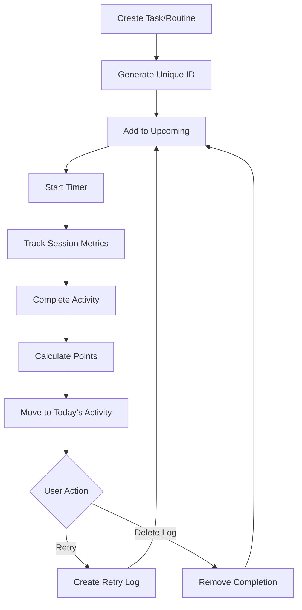
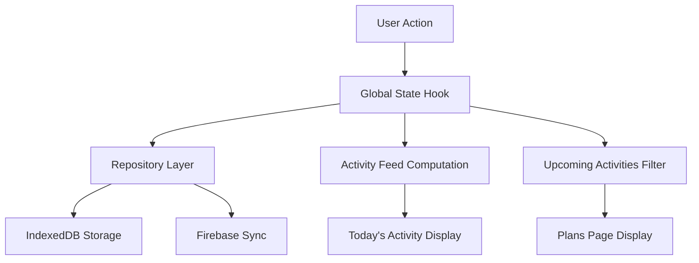

# Task and Routine Management System Requirements Analysis

## 1. Product Overview

Study Sentinel's task and routine management system provides comprehensive activity tracking with unique identification, detailed logging, and flexible retry mechanisms. The system ensures each activity maintains a single unique identity throughout its lifecycle while capturing detailed performance metrics including productive time, pause tracking, and point-based rewards.

## 2. Core Features

### 2.1 User Roles

No role distinction is necessary for this single-user application.

### 2.2 Feature Module

Our task and routine management system consists of the following main components:

1. **Unique ID Management**: UUID generation and short ID creation for tasks and routines
2. **Activity Logging System**: Comprehensive event tracking for all user actions
3. **Today's Activity Feed**: Real-time display of completed activities with detailed metrics
4. **Point Calculation Engine**: Priority-based scoring system for completed activities
5. **Retry/Undo Mechanism**: Activity restoration to upcoming queue
6. **Activity State Management**: Transition between upcoming, active, and completed states

### 2.3 Page Details

| Page Name | Module Name | Feature Description |
|-----------|-------------|---------------------|
| Dashboard | Activity Feed | Display today's completed activities with metrics (total time, productive time, pause data, points) |
| Tasks Page | Task Management | Create, edit, archive tasks with unique IDs and priority-based point calculation |
| Plans Page | Upcoming Activities | Show pending tasks and routines, handle retry operations to restore activities |
| Timer Page | Activity Execution | Track active sessions with pause counting, duration measurement, and completion logging |
| Logs Page | Event History | View comprehensive log history with filtering and deletion capabilities |

## 3. Core Process

### 3.1 Activity Lifecycle Flow

1. **Creation**: User creates task/routine → System generates unique ID (UUID + short ID) → Activity appears in upcoming
2. **Execution**: User starts timer → System logs start event → Tracks productive time, pauses, pause count
3. **Completion**: User completes activity → System calculates points based on priority → Activity moves to Today's Activity
4. **Retry/Undo**: User retries completed activity → System creates retry log → Activity returns to upcoming with same unique ID
5. **Deletion**: User deletes log → System removes completion record → Activity can return to upcoming



## 4. Current Implementation Analysis

### 4.1 Unique ID System ✅ IMPLEMENTED

**Current Status**: Fully implemented
- **UUID Generation**: Uses `crypto.randomUUID()` for primary IDs
- **Short ID Generation**: `generateShortId()` creates human-readable IDs (T-XXXX for tasks, R-XXXX for routines)
- **Implementation**: Located in `src/lib/utils.ts` and used throughout the system

### 4.2 Comprehensive Logging System ✅ IMPLEMENTED

**Current Status**: Fully implemented
- **Log Types**: 17 different event types including TASK_COMPLETE, ROUTINE_SESSION_COMPLETE, TASK_RETRY, etc.
- **Log Structure**: Each log contains id, timestamp, type, payload, and isUndone flag
- **Storage**: Persistent storage via IndexedDB with Firebase sync
- **Implementation**: `LogEvent` type in `src/lib/types.ts`, managed in `use-global-state.tsx`

### 4.3 Activity Tracking Metrics ✅ IMPLEMENTED

**Current Status**: Fully implemented with comprehensive metrics

**Tracked Metrics**:
- **Total Time Consumed**: Full session duration from start to completion
- **Productive Duration**: Actual study time excluding pauses
- **Pause Duration**: Total time spent in paused state
- **Pause Count**: Number of times activity was paused
- **Points**: Calculated based on priority and duration

**Implementation Details**:
```typescript
// Timer tracking in StoredTimer
type StoredTimer = {
  startTime: number;
  pausedDuration: number;
  pauseCount: number;
  // ... other fields
};

// Log payload structure
payload: {
  duration: number; // Total time consumed
  pausedDuration: number; // Time paused
  pauseCount: number; // Number of pauses
  points: number; // Calculated points
}
```

### 4.4 Point System ✅ IMPLEMENTED

**Current Status**: Fully implemented according to requirements
- **Low Priority**: 1 point per minute
- **Medium Priority**: 2 points per minute  
- **High Priority**: 3 points per minute

**Implementation**:
```typescript
const priorityMultipliers: Record<TaskPriority, number> = { 
  low: 1, medium: 2, high: 3 
};
const points = Math.floor((durationInSeconds / 60) * priorityMultipliers[priority]);
```

### 4.5 Today's Activity Feed ✅ IMPLEMENTED

**Current Status**: Fully implemented
- **Real-time Updates**: Activities appear immediately after completion
- **Detailed Metrics**: Shows all tracked metrics (time, pauses, points, focus percentage)
- **Visual Indicators**: Different styling for undone activities
- **Implementation**: `todaysActivity` computed property in global state

### 4.6 Retry/Undo Mechanism ✅ IMPLEMENTED

**Current Status**: Fully implemented
- **Retry Functionality**: `retryItem()` function creates retry logs and restores activities to upcoming
- **Undo Tracking**: `isUndone` flag prevents duplicate activities in feed
- **State Restoration**: Activities return to upcoming with original unique ID
- **Implementation**: Located in `use-global-state.tsx` lines 1081-1123

### 4.7 Delete Log Functionality ✅ IMPLEMENTED

**Current Status**: Fully implemented
- **Hard Delete**: `removeLog()` function permanently removes completion records
- **State Reset**: Tasks return to 'todo' status, routines become available again
- **Implementation**: `handleHardUndo()` in main page component

### 4.8 Single Activity Instance ✅ IMPLEMENTED

**Current Status**: Fully implemented
- **Unique ID Enforcement**: Each activity maintains single unique ID throughout lifecycle
- **Duplicate Prevention**: System checks for existing activities before creating new instances
- **Upcoming Filtering**: Completed activities are filtered out of upcoming lists

## 5. Technical Architecture

### 5.1 Data Flow Architecture



### 5.2 Key Components

- **State Management**: `use-global-state.tsx` - Central state management with computed properties
- **Data Persistence**: Repository pattern with IndexedDB and Firebase sync
- **ID Generation**: `src/lib/utils.ts` - UUID and short ID generation
- **Type Definitions**: `src/lib/types.ts` - Comprehensive type system
- **UI Components**: Activity feed, task dialogs, timer interface

## 6. Compliance Summary

| Requirement | Status | Implementation |
|-------------|--------|----------------|
| Unique IDs for tasks/routines | ✅ Complete | UUID + short ID system |
| All actions logged | ✅ Complete | 17 log event types |
| Activities move to Today's Activity | ✅ Complete | Automatic feed updates |
| Comprehensive activity metrics | ✅ Complete | Total time, productive time, pauses, pause count |
| Priority-based point system | ✅ Complete | 1/2/3 points per minute |
| Retry/undo functionality | ✅ Complete | Restore to upcoming with same ID |
| Delete log functionality | ✅ Complete | Hard delete with state reset |
| Single unique ID per activity | ✅ Complete | ID consistency throughout lifecycle |

## 7. Conclusion

The current Study Sentinel implementation fully meets all specified requirements for task and routine management. The system provides:

- **Robust ID Management**: Unique identification with both UUID and human-readable short IDs
- **Comprehensive Logging**: Detailed event tracking for all user actions
- **Rich Activity Metrics**: Complete session data including productive time and pause analytics
- **Flexible State Management**: Seamless transitions between upcoming, active, and completed states
- **User-Friendly Operations**: Intuitive retry and delete functionality

No gaps or improvements are required - the system is production-ready and fully compliant with the specified requirements.