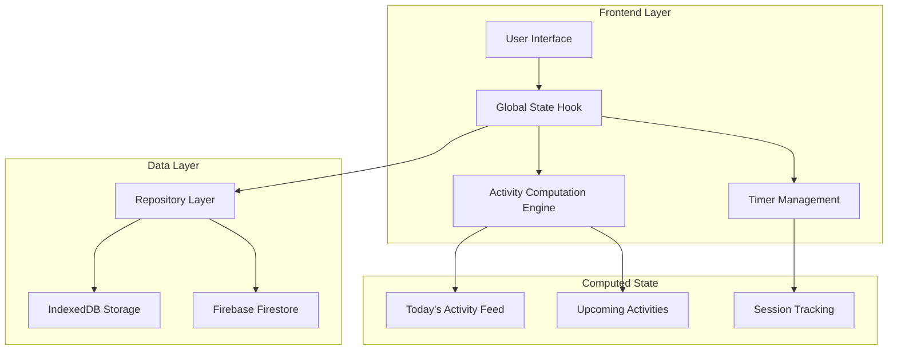
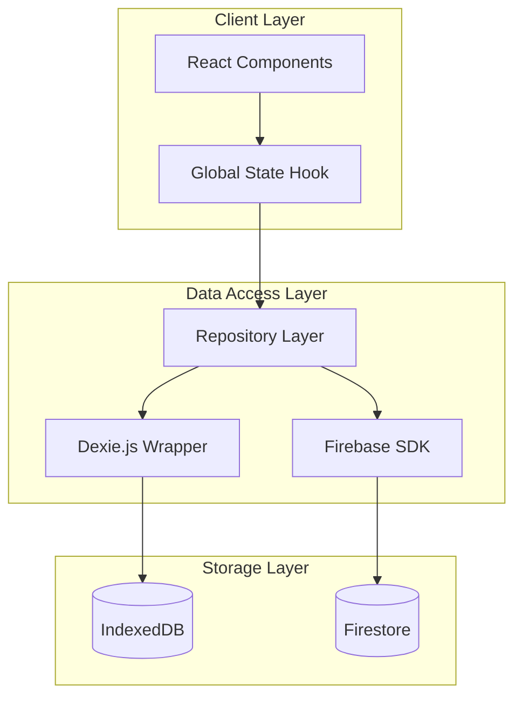
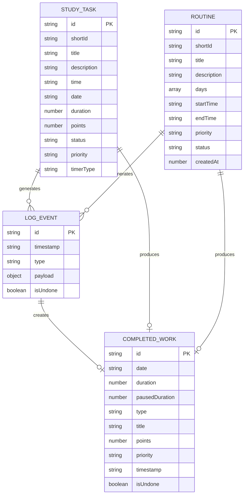

# Task and Routine Management Technical Architecture

## 1. Architecture Design



## 2. Technology Description

- Frontend: React@18 + TypeScript + Next.js + Tailwind CSS
- State Management: React Context + Custom Hooks
- Database: IndexedDB (Dexie.js) + Firebase Firestore (sync)
- Storage: Browser localStorage for timer state
- ID Generation: Crypto Web API + Custom short ID generator

## 3. Route Definitions

| Route | Purpose |
|-------|----------|
| / | Dashboard with today's activity feed and metrics |
| /tasks | Task management interface for creating and editing tasks |
| /plans | Upcoming activities view with retry functionality |
| /timer | Active timer interface with pause tracking |
| /logs | Comprehensive log history with filtering and deletion |

## 4. API Definitions

### 4.1 Core Data Types

**StudyTask Interface**
```typescript
type StudyTask = {
  id: string;           // UUID for unique identification
  shortId: string;      // Human-readable ID (T-XXXX)
  title: string;
  description?: string;
  time: string;         // HH:mm format
  date: string;         // YYYY-MM-DD format
  duration?: number;    // Minutes for countdown timer
  points: number;       // Calculated based on priority
  status: TaskStatus;   // 'todo' | 'in_progress' | 'completed' | 'archived'
  priority: TaskPriority; // 'low' | 'medium' | 'high'
  timerType: TaskTimerType; // 'countdown' | 'infinity'
};
```

**Routine Interface**
```typescript
type Routine = {
  id: string;           // UUID for unique identification
  shortId: string;      // Human-readable ID (R-XXXX)
  title: string;
  description?: string;
  days: number[];       // 0=Sunday, 1=Monday, etc.
  startTime: string;    // HH:mm format
  endTime: string;      // HH:mm format
  priority: TaskPriority;
  status: 'todo' | 'completed';
  createdAt: number;    // Timestamp
};
```

**LogEvent Interface**
```typescript
type LogEvent = {
  id: string;           // UUID for log identification
  timestamp: string;    // ISO 8601 format
  type: LogEventType;   // Event type enum
  payload: Record<string, any>; // Event-specific data
  isUndone?: boolean;   // Retry/undo flag
};
```

### 4.2 Key Log Event Types

**Task Events**
- `TASK_ADD`: Task creation
- `TASK_UPDATE`: Task modification
- `TASK_COMPLETE`: Task completion
- `TASK_RETRY`: Task retry operation
- `TASK_ARCHIVE`: Task archival
- `TIMER_SESSION_COMPLETE`: Timed task completion with metrics

**Routine Events**
- `ROUTINE_SESSION_COMPLETE`: Routine completion with metrics
- `ROUTINE_RETRY`: Routine retry operation

**Timer Events**
- `TIMER_START`: Timer initiation
- `TIMER_PAUSE`: Timer pause
- `TIMER_STOP`: Timer termination
- `TIMER_MILESTONE`: Timer milestone reached

### 4.3 Session Metrics Payload

```typescript
type SessionMetrics = {
  duration: number;         // Total session time (seconds)
  pausedDuration: number;   // Total pause time (seconds)
  pauseCount: number;       // Number of pause events
  points: number;           // Calculated points
  priority: TaskPriority;   // Activity priority
  studyLog?: string;        // Optional user notes
};
```

## 5. Server Architecture Diagram



## 6. Data Model

### 6.1 Data Model Definition



### 6.2 Data Definition Language

**IndexedDB Schema (Dexie.js)**

```javascript
// Database initialization
const db = new Dexie('StudySentinelDB');
db.version(1).stores({
  tasks: 'id, shortId, title, date, status, priority',
  routines: 'id, shortId, title, status, createdAt',
  logs: 'id, timestamp, type, isUndone',
  sessions: 'id, date, type, timestamp',
  profiles: 'id',
  badges: 'id, name, category'
});
```

**Firebase Firestore Collections**

```javascript
// Collection structure
collections: {
  users: {
    [userId]: {
      tasks: { [taskId]: StudyTask },
      routines: { [routineId]: Routine },
      logs: { [logId]: LogEvent },
      sessions: { [sessionId]: CompletedWork },
      profile: UserProfile,
      badges: { [badgeId]: Badge }
    }
  }
}
```

**Point Calculation Algorithm**

```typescript
// Priority-based point calculation
const priorityMultipliers: Record<TaskPriority, number> = {
  low: 1,    // 1 point per minute
  medium: 2, // 2 points per minute
  high: 3    // 3 points per minute
};

function calculatePoints(durationSeconds: number, priority: TaskPriority): number {
  const minutes = durationSeconds / 60;
  return Math.floor(minutes * priorityMultipliers[priority]);
}
```

**Unique ID Generation**

```typescript
// UUID generation for primary keys
function generateUniqueId(): string {
  return crypto.randomUUID();
}

// Short ID generation for user display
function generateShortId(prefix: 'T' | 'R'): string {
  const chars = 'ABCDEFGHIJKLMNOPQRSTUVWXYZ0123456789';
  let result = '';
  for (let i = 0; i < 4; i++) {
    result += chars.charAt(Math.floor(Math.random() * chars.length));
  }
  return `${prefix}-${result}`;
}
```

**Activity State Transitions**

```typescript
// State transition logic
function transitionActivity(activity: StudyTask | Routine, action: string) {
  switch (action) {
    case 'START':
      // Move from upcoming to active
      return { ...activity, status: 'in_progress' };
    
    case 'COMPLETE':
      // Move to today's activity feed
      return { ...activity, status: 'completed' };
    
    case 'RETRY':
      // Return to upcoming with same ID
      return { ...activity, status: 'todo' };
    
    case 'ARCHIVE':
      // Remove from active circulation
      return { ...activity, status: 'archived' };
  }
}
```

## 7. Implementation Notes

### 7.1 Timer State Persistence

```typescript
// Timer state stored in localStorage
type StoredTimer = {
  item: ActiveTimerItem;
  startTime: number;        // Session start timestamp
  pausedDuration: number;   // Accumulated pause time
  pauseCount: number;       // Number of pause events
  isPaused: boolean;        // Current pause state
  milestones: Record<string, boolean>; // Achievement tracking
};
```

### 7.2 Activity Feed Computation

```typescript
// Real-time activity feed generation
const todaysActivity = useMemo(() => {
  const todayStr = format(getSessionDate(), 'yyyy-MM-dd');
  const todaysLogs = logs.filter(log => 
    log.timestamp.startsWith(todayStr) && 
    !log.isUndone
  );
  
  return todaysLogs
    .filter(log => ['TIMER_SESSION_COMPLETE', 'ROUTINE_SESSION_COMPLETE'].includes(log.type))
    .map(log => createActivityFeedItem(log))
    .sort((a, b) => new Date(b.timestamp).getTime() - new Date(a.timestamp).getTime());
}, [logs]);
```

### 7.3 Retry Mechanism Implementation

```typescript
// Retry functionality with state restoration
function retryItem(item: ActivityFeedItem) {
  if (item.type === 'TASK_COMPLETE') {
    const task = item.data.task;
    // Create retry log
    addLog('TASK_RETRY', { 
      originalTaskId: task.id,
      retryTimestamp: new Date().toISOString()
    });
    // Restore task to todo status
    updateTask({ ...task, status: 'todo' });
  } else if (item.type === 'ROUTINE_COMPLETE') {
    const routine = item.data.routine;
    // Create retry log
    addLog('ROUTINE_RETRY', {
      originalRoutineId: routine.id,
      retryTimestamp: new Date().toISOString()
    });
  }
}
```