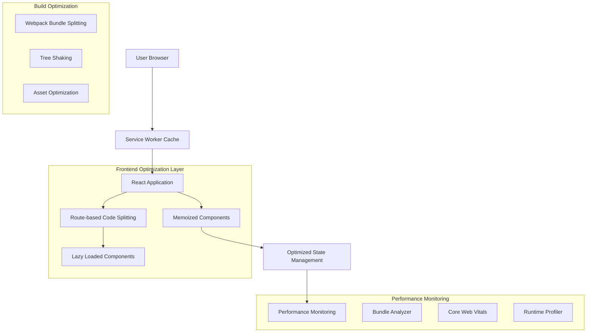

# Task 3: Performance Optimization Technical Architecture

## 1. Architecture Design



## 2. Technology Description

- **Frontend**: React@18 + Next.js@14 + TypeScript
- **Build Tools**: Webpack 5 + SWC compiler
- **Performance Tools**: 
  - webpack-bundle-analyzer for bundle analysis
  - @next/bundle-analyzer for Next.js specific analysis
  - React DevTools Profiler for component performance
  - web-vitals library for Core Web Vitals tracking
- **Optimization Libraries**:
  - react-window for virtual scrolling
  - react-intersection-observer for lazy loading
  - use-debounce for input optimization

## 3. Performance Optimization Strategies

### 3.1 Code Splitting Implementation

| Strategy | Implementation | Expected Impact |
|----------|----------------|----------------|
| Route-based splitting | Dynamic imports with Next.js pages | 40-50% initial bundle reduction |
| Component lazy loading | React.lazy() + Suspense | 20-30% chunk size reduction |
| Vendor splitting | Webpack splitChunks configuration | Better caching, 15-20% improvement |

### 3.2 React Performance Patterns

| Pattern | Use Case | Implementation |
|---------|----------|----------------|
| React.memo | Pure components that re-render frequently | Wrap components with expensive render logic |
| useMemo | Expensive calculations | Cache computed values based on dependencies |
| useCallback | Event handlers passed as props | Prevent unnecessary child re-renders |
| State colocation | Minimize context re-renders | Move state closer to where it's used |

### 3.3 Bundle Optimization Techniques

| Technique | Tool/Method | Expected Reduction |
|-----------|-------------|-------------------|
| Tree shaking | Webpack + ES modules | 10-15% bundle size |
| Import optimization | Specific imports vs barrel exports | 5-10% bundle size |
| Asset compression | next-optimized-images + WebP | 30-50% asset size |
| CSS optimization | PurgeCSS + CSS modules | 20-30% CSS size |

## 4. Implementation Architecture

### 4.1 Code Splitting Structure

```typescript
// Route-based splitting
const TimerPage = lazy(() => import('../app/timer/page'));
const TasksPage = lazy(() => import('../app/tasks/page'));
const StatsPage = lazy(() => import('../app/stats/page'));
const BadgesPage = lazy(() => import('../app/badges/page'));

// Component-based splitting
const HeavyChart = lazy(() => import('../components/stats/heavy-chart'));
const BadgeModal = lazy(() => import('../components/badges/badge-modal'));
```

### 4.2 Memoization Strategy

```typescript
// Component memoization
const TaskItem = React.memo(({ task, onUpdate }) => {
  const handleUpdate = useCallback((updates) => {
    onUpdate(task.id, updates);
  }, [task.id, onUpdate]);
  
  return <div>{/* Task content */}</div>;
});

// Expensive calculation memoization
const StatsComponent = () => {
  const expensiveStats = useMemo(() => {
    return calculateComplexStats(tasks, logs);
  }, [tasks, logs]);
  
  return <div>{/* Stats display */}</div>;
};
```

### 4.3 Virtual Scrolling Implementation

```typescript
// For large lists (tasks, logs, badges)
import { FixedSizeList as List } from 'react-window';

const VirtualizedTaskList = ({ tasks }) => {
  const Row = ({ index, style }) => (
    <div style={style}>
      <TaskItem task={tasks[index]} />
    </div>
  );
  
  return (
    <List
      height={600}
      itemCount={tasks.length}
      itemSize={80}
    >
      {Row}
    </List>
  );
};
```

## 5. Performance Monitoring Architecture

### 5.1 Core Web Vitals Tracking

```typescript
// Performance monitoring setup
import { getCLS, getFID, getFCP, getLCP, getTTFB } from 'web-vitals';

const sendToAnalytics = (metric) => {
  // Send to analytics service
  console.log(metric);
};

getCLS(sendToAnalytics);
getFID(sendToAnalytics);
getFCP(sendToAnalytics);
getLCP(sendToAnalytics);
getTTFB(sendToAnalytics);
```

### 5.2 Bundle Analysis Integration

```javascript
// next.config.js
const withBundleAnalyzer = require('@next/bundle-analyzer')({
  enabled: process.env.ANALYZE === 'true',
});

module.exports = withBundleAnalyzer({
  webpack: (config, { isServer }) => {
    if (!isServer) {
      config.optimization.splitChunks = {
        chunks: 'all',
        cacheGroups: {
          vendor: {
            test: /[\\/]node_modules[\\/]/,
            name: 'vendors',
            chunks: 'all',
          },
        },
      };
    }
    return config;
  },
});
```

## 6. Memory Management Architecture

### 6.1 Cleanup Patterns

```typescript
// Effect cleanup
useEffect(() => {
  const controller = new AbortController();
  
  fetchData(controller.signal)
    .then(setData)
    .catch(handleError);
  
  return () => {
    controller.abort();
  };
}, []);

// Timer cleanup
useEffect(() => {
  const interval = setInterval(updateTimer, 1000);
  
  return () => {
    clearInterval(interval);
  };
}, []);
```

### 6.2 Efficient Data Structures

```typescript
// Use Maps for O(1) lookups
const taskMap = useMemo(() => {
  return new Map(tasks.map(task => [task.id, task]));
}, [tasks]);

// Use Sets for unique collections
const completedTaskIds = useMemo(() => {
  return new Set(logs.map(log => log.taskId));
}, [logs]);
```

## 7. Build Optimization Configuration

### 7.1 Webpack Optimization

```javascript
// webpack.config.js optimizations
module.exports = {
  optimization: {
    splitChunks: {
      chunks: 'all',
      cacheGroups: {
        vendor: {
          test: /[\\/]node_modules[\\/]/,
          name: 'vendors',
          chunks: 'all',
        },
        common: {
          name: 'common',
          minChunks: 2,
          chunks: 'all',
        },
      },
    },
    usedExports: true,
    sideEffects: false,
  },
};
```

### 7.2 Asset Optimization

```javascript
// next.config.js image optimization
module.exports = {
  images: {
    formats: ['image/webp', 'image/avif'],
    deviceSizes: [640, 750, 828, 1080, 1200, 1920, 2048, 3840],
    imageSizes: [16, 32, 48, 64, 96, 128, 256, 384],
  },
};
```

## 8. Performance Budget Configuration

### 8.1 Bundle Size Limits

```json
{
  "budgets": [
    {
      "type": "initial",
      "maximumWarning": "200kb",
      "maximumError": "250kb"
    },
    {
      "type": "anyComponentStyle",
      "maximumWarning": "6kb",
      "maximumError": "10kb"
    }
  ]
}
```

### 8.2 Performance Metrics Thresholds

```typescript
// Performance thresholds
const PERFORMANCE_THRESHOLDS = {
  LCP: 2500, // Largest Contentful Paint
  FID: 100,  // First Input Delay
  CLS: 0.1,  // Cumulative Layout Shift
  FCP: 1800, // First Contentful Paint
  TTFB: 800, // Time to First Byte
};
```

## 9. Development Tools Integration

### 9.1 Performance Profiling

```typescript
// Development performance hooks
const usePerformanceProfiler = (componentName: string) => {
  useEffect(() => {
    if (process.env.NODE_ENV === 'development') {
      performance.mark(`${componentName}-start`);
      
      return () => {
        performance.mark(`${componentName}-end`);
        performance.measure(
          componentName,
          `${componentName}-start`,
          `${componentName}-end`
        );
      };
    }
  }, [componentName]);
};
```

### 9.2 Bundle Analysis Scripts

```json
{
  "scripts": {
    "analyze": "ANALYZE=true npm run build",
    "analyze:server": "BUNDLE_ANALYZE=server npm run build",
    "analyze:browser": "BUNDLE_ANALYZE=browser npm run build"
  }
}
```