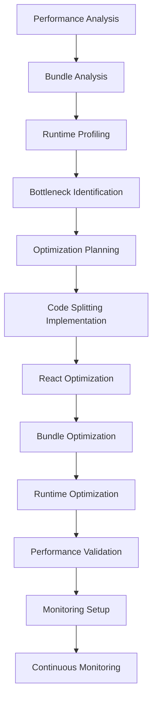

# Task 3: Performance Optimization Requirements

## 1. Product Overview
Implement comprehensive performance optimizations for the Study Sentinel application to improve loading times, reduce bundle sizes, and enhance user experience through efficient resource management and React performance best practices.

## 2. Core Features

### 2.1 Performance Optimization Areas

| Optimization Area | Target Improvement | Implementation Method |
|-------------------|-------------------|----------------------|
| Bundle Size | Reduce by 30-40% | Code splitting, tree shaking, lazy loading |
| Initial Load Time | Reduce by 50% | Route-based code splitting, critical resource prioritization |
| Runtime Performance | Improve by 40% | Memoization, virtual scrolling, efficient re-renders |
| Memory Usage | Reduce by 25% | Component cleanup, efficient state management |

### 2.2 Feature Module
Our performance optimization requirements consist of the following main areas:
1. **Code Splitting & Lazy Loading**: Route-based splitting, component lazy loading, dynamic imports.
2. **React Performance**: Memoization strategies, render optimization, efficient hooks usage.
3. **Bundle Optimization**: Tree shaking, dependency analysis, chunk optimization.
4. **Runtime Optimization**: Virtual scrolling, efficient data structures, memory management.
5. **Monitoring & Analytics**: Performance metrics, bundle analysis, runtime monitoring.

### 2.3 Page Details

| Area | Module Name | Feature Description |
|------|-------------|--------------------|
| Code Splitting | Route-based Splitting | Implement dynamic imports for all major routes (/timer, /tasks, /stats, /badges, etc.) |
| Code Splitting | Component Lazy Loading | Lazy load heavy components (charts, modals, complex forms) |
| Code Splitting | Vendor Splitting | Separate vendor bundles from application code |
| React Performance | Component Memoization | Apply React.memo to pure components, useMemo for expensive calculations |
| React Performance | Callback Optimization | Use useCallback for event handlers and function props |
| React Performance | State Optimization | Minimize re-renders through efficient state structure |
| Bundle Optimization | Tree Shaking | Remove unused code and dependencies |
| Bundle Optimization | Import Analysis | Optimize import statements and reduce bundle bloat |
| Bundle Optimization | Asset Optimization | Compress images, optimize fonts, minimize CSS |
| Runtime Optimization | Virtual Scrolling | Implement for large lists (tasks, logs, badges) |
| Runtime Optimization | Memory Management | Cleanup subscriptions, timers, and event listeners |
| Runtime Optimization | Efficient Data Structures | Use Maps/Sets where appropriate, optimize data access patterns |
| Monitoring | Performance Metrics | Implement Core Web Vitals tracking |
| Monitoring | Bundle Analysis | Set up webpack-bundle-analyzer for ongoing monitoring |
| Monitoring | Runtime Profiling | Add performance profiling hooks for development |

## 3. Core Process

### Performance Optimization Flow
1. **Analysis Phase**: Identify current performance bottlenecks using profiling tools
2. **Implementation Phase**: Apply optimizations in priority order (high impact, low effort first)
3. **Validation Phase**: Measure improvements and validate performance gains
4. **Monitoring Phase**: Set up ongoing performance monitoring and alerts

## 4. Technical Implementation

### 4.1 Code Splitting Strategy
- **Route-level splitting**: Each major route becomes a separate chunk
- **Component-level splitting**: Heavy components loaded on demand
- **Vendor splitting**: Third-party libraries in separate bundles
- **Dynamic imports**: Use React.lazy() and Suspense for loading states

### 4.2 React Performance Patterns
- **Memoization**: React.memo for components, useMemo for calculations, useCallback for functions
- **State optimization**: Minimize context re-renders, use state colocation
- **Render optimization**: Avoid inline objects/functions, use keys properly
- **Hook optimization**: Custom hooks for complex logic, dependency array optimization

### 4.3 Bundle Optimization Techniques
- **Tree shaking**: Remove unused exports and dependencies
- **Import optimization**: Use specific imports instead of barrel exports
- **Asset optimization**: Compress images, use modern formats (WebP, AVIF)
- **CSS optimization**: Remove unused styles, use CSS modules

### 4.4 Runtime Performance Improvements
- **Virtual scrolling**: For lists with >100 items
- **Debouncing/throttling**: For search inputs and resize handlers
- **Memory cleanup**: useEffect cleanup functions, AbortController for requests
- **Efficient data structures**: Use appropriate data types for performance

## 5. Performance Targets

### 5.1 Core Web Vitals
- **Largest Contentful Paint (LCP)**: < 2.5 seconds
- **First Input Delay (FID)**: < 100 milliseconds
- **Cumulative Layout Shift (CLS)**: < 0.1

### 5.2 Bundle Size Targets
- **Initial bundle**: < 200KB gzipped
- **Route chunks**: < 50KB gzipped each
- **Vendor bundle**: < 150KB gzipped
- **Total bundle reduction**: 30-40% from current size

### 5.3 Runtime Performance Targets
- **Time to Interactive**: < 3 seconds
- **Memory usage**: < 50MB for typical session
- **Frame rate**: Maintain 60fps during interactions
- **Network requests**: Minimize and optimize API calls

## 6. Implementation Priority

### 6.1 High Priority (Week 1)
1. Route-based code splitting for major pages
2. Component memoization for frequently re-rendering components
3. Bundle analysis and vendor splitting
4. Critical resource optimization

### 6.2 Medium Priority (Week 2)
1. Component-level lazy loading
2. Virtual scrolling for large lists
3. Asset optimization (images, fonts)
4. Memory leak prevention

### 6.3 Low Priority (Week 3)
1. Advanced memoization strategies
2. Performance monitoring setup
3. Progressive loading strategies
4. Service worker optimizations

## 7. Success Metrics

### 7.1 Quantitative Metrics
- Bundle size reduction: 30-40%
- Initial load time improvement: 50%
- Runtime performance improvement: 40%
- Memory usage reduction: 25%
- Core Web Vitals scores in "Good" range

### 7.2 Qualitative Metrics
- Improved user experience during navigation
- Faster perceived performance
- Reduced loading states and spinners
- Smoother animations and interactions
- Better performance on low-end devices

## 8. Monitoring and Maintenance

### 8.1 Performance Monitoring Tools
- **Bundle analyzer**: webpack-bundle-analyzer for build-time analysis
- **Runtime monitoring**: Performance API for Core Web Vitals
- **Development tools**: React DevTools Profiler for component analysis
- **CI/CD integration**: Performance budgets in build pipeline

### 8.2 Ongoing Maintenance
- Regular bundle size audits
- Performance regression testing
- Dependency update impact analysis
- User experience monitoring and feedback collection